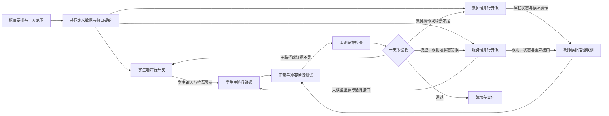
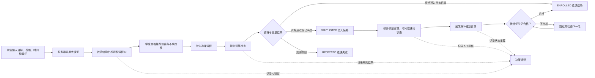

# AI课程选课冲突与候补调整系统：项目全景图

## 1. 文档信息

| 项目 | 内容 |
|---|---|
| 文档阶段 | ① project-flow-map |
| 文档目的 | 明确学生端、教师端、服务端的角色流转、阶段输入输出、交付物、交接边界及大模型/规则/人工分工 |
| 项目周期 | 1天薄原型 |
| 当前状态 | 待人工确认 |
| 后续文档 | `product-prd.md` |

> 本文只定义项目全景、角色职责和交接规则，不在此阶段确定最终页面样式、模型供应商、接口字段细节或完整测试用例。

## 2. 项目目标与边界

本项目构建一个接入真实大模型的课程推荐、选课冲突检查与候补动态调整原型，面向学生和教师两个角色，完成以下业务闭环：

```text
学生提交学习目标和偏好
→ 大模型推荐课程并说明理由
→ 规则引擎检查先修、冲突、重复选课和容量
→ 返回选课成功、进入候补或选课失败
→ 教师调整课程容量、时间或状态
→ 系统重新检查候补资格并执行递补
→ 学生和教师查看完整决策记录
```

项目成功不取决于页面数量，而取决于主流程、判断触发、失败场景和追溯证据是否完整。全流程必须遵守以下红线：

- 必须真实调用大模型API，不得用静态文案冒充模型调用结果。
- 大模型只负责理解需求、推荐课程和解释理由，不得直接决定选课资格和候补顺序。
- 大模型只能推荐课程目录中真实存在的课程ID，所有模型输出必须经过服务端结构化校验。
- 先修、时间冲突、重复选课、容量和候补顺序必须由确定性规则判断。
- 推荐不等于可选，候补顺序不等于必然获得名额。
- 课程容量、时间或状态发生变化后，必须重新检查候补学生资格。
- 每次结果必须能追溯到学生输入、大模型建议、规则判断和人工操作。
- 正常、边界和失败场景必须能够使用固定模拟数据重复演示。

### 2.1 一天版必须保留

- 一条从学生输入到最终结果的完整主路径。
- 一次真实大模型推荐调用。
- 一组实际生效的硬规则。
- 选课成功、候补和失败三种结果。
- 一次由教师操作触发的候补重算。
- 至少三个边界或失败场景。
- 完整决策追溯。

### 2.2 一天版明确不做

- 注册、登录和正式权限系统。
- 正式教务数据库和真实学生数据。
- 多用户并发选课与事务竞争。
- 完整课程增删改查。
- 消息通知和复杂审批流。
- 模型训练、微调或复杂推荐算法。
- 复杂页面动画和生产级部署。

## 3. 角色与职责

| 角色 | 核心职责 | 主要决策权 | 主要交付物 |
|---|---|---|---|
| 学生端负责人 | 完成学生信息输入、AI推荐展示、选课操作、状态反馈和学生视角追溯 | 学生交互流程、学生端字段需求、学生场景验收 | 学生端页面、接口封装、学生Mock数据、学生端场景记录 |
| 教师端负责人 | 完成课程状态、已选/候补名单、容量调整、候补重算和人工处理展示 | 教师操作流程、课程模拟数据、演示组织 | 教师端页面、课程/候补Mock数据、教师操作记录、演示脚本 |
| 服务端负责人 | 接入大模型，执行硬规则，管理选课/候补状态，提供统一接口与追溯 | 服务端实现、规则执行顺序、状态一致性、异常降级 | 后端服务、模型客户端、规则引擎、候补服务、追溯记录、接口说明 |
| 大模型 | 理解自然语言目标，从固定目录推荐课程，生成理由、不确定性和替代建议 | 无选课资格与候补顺序决策权 | 结构化推荐候选、推荐理由、不确定性说明 |
| 人工审查者 | 确认需求边界、业务规则、例外处理、验收结果和最终演示结论 | 所有最终需求、风险接受、例外审批和项目放行 | 确认记录、取舍理由、验收结论 |

说明：三名成员分别主责学生端、教师端和服务端。学生端与教师端负责人不能只制作静态页面，还需承担各自的数据准备、接口联调和场景测试，以平衡服务端工作量。

## 4. 端到端流程图



主流程：共同契约 → 三端并行开发 → 学生主路径联调 → 教师候补路径联调 → 场景测试 → 追溯检查 → 演示交付。任何一端发现接口字段、状态含义或业务规则不明确，都应立即退回共同契约确认，不得在本端静默补充不同假设。

## 5. 系统业务闭环



## 6. 阶段输入、输出与交接边界

| 阶段 | 负责人 | 输入 | 核心活动 | 输出/交付物 | 大模型/AI可辅助项 | 必须由人工完成 | 交接门禁 |
|---|---|---|---|---|---|---|---|
| 1. 项目全景确认 | 三人共同 | 题目要求、一天限制、四项最低演示要求 | 确定项目目标、三端职责、业务红线和非目标 | `01_project-flow-map.md` | 发散流程、风险和边界候选 | 确认分工、范围和是否进入PRD | 三端边界无冲突；必须做与不做已明确 |
| 2. 产品需求定义 | 学生端负责人主笔，三人评审 | 已确认项目全景 | 定义学生主路径、教师操作、服务端结果和验收标准 | `product-prd.md` | 草拟用户故事、AC和失败场景 | 保留需求取舍、确认Top需求和Non-goals | 每项需求有可演示AC；一天内可完成 |
| 3. 方案与契约设计 | 服务端负责人主笔，前端共同确认 | PRD、模拟数据需求、模型限制 | 定义数据对象、接口、状态、Prompt输入输出、异常路径 | `03_design-options.md`、接口契约草案 | 生成结构化Schema、候选Prompt和错误清单 | 决定规则顺序、状态含义、模型与规则边界 | 学生端和教师端可按同一Mock契约独立开发 |
| 4. 三端并行开发 | 三名成员分别负责 | 已确认接口契约、Mock数据 | 学生端、教师端和服务端并行实现；前端先接Mock | 页面、后端接口、规则模块、模型调用、模拟数据 | 辅助编码、格式检查、接口样例生成 | 审查业务正确性、API Key安全、范围控制 | 各端可单独启动；核心页面和接口可调用 |
| 5. 学生主路径联调 | 学生端、服务端 | 学生页面、推荐和选课接口 | 跑通输入、推荐、选择、规则判断和结果展示 | 可运行的学生主路径、联调记录 | 分析接口错误、生成调试输入 | 确认推荐真实、规则结果正确、提示可理解 | 正常成功、冲突失败、满员候补均可复现 |
| 6. 教师候补路径联调 | 教师端、服务端 | 教师页面、候补状态、重算接口 | 跑通查看名单、释放名额、资格重检和递补 | 可运行的教师路径、重算记录 | 辅助构造候补数据和错误分析 | 确认候补公平、跳过理由和人工操作合理 | 第一名失效时能继续检查下一名 |
| 7. 测试与追溯验证 | 三人共同 | 完整闭环、固定场景、决策记录 | 回放正常、边界、失败场景；检查输入到结果的证据链 | 测试结果、缺陷清单、追溯截图或记录 | 发散边界用例、检查字段缺失和状态矛盾 | 判断缺陷有效性、确认是否可演示 | 四个验收场景通过；无关键状态矛盾 |
| 8. 演示与交付 | 教师端负责人组织，三人参与 | 可运行原型、测试结果、演示脚本 | 按固定数据演示主路径、候补变化和失败恢复 | 原型、README、演示脚本、最终文档 | 整理说明、生成演示提纲 | 实际运行、最终验收和放行 | 主流程可重复运行；失败时有可用备用场景 |

## 7. 关键交接契约

### 7.1 项目全景 → 产品需求

- 必须确认项目仅包含学生端、教师端和统一服务端三个主要部分。
- 必须确认真实大模型调用是必选项，而不是可选增强项。
- 必须确认大模型不拥有硬规则和候补顺序决策权。
- 未确认的页面、状态或人工审批需求不得直接进入开发。

### 7.2 产品需求 → 方案设计

- 每条保留需求必须对应可演示的验收标准。
- 必须定义学生主路径和教师候补路径。
- 必须至少定义正常、边界和失败三类场景。
- 必须明确一天版Non-goals，禁止服务端自行扩大范围。

### 7.3 方案设计 → 三端开发

- 学生端和教师端必须使用同一份课程、学生和状态Schema。
- Mock响应与真实服务端响应必须保持字段一致。
- 所有状态统一使用 `ENROLLED`、`WAITLISTED`、`REJECTED` 等约定值。
- 大模型推荐结果必须包含课程ID、推荐分数、理由和不确定性。
- 服务端必须明确超时、非法JSON和虚构课程ID的处理方式。

### 7.4 学生端 → 服务端

- 提交学生原始输入和结构化偏好，不在前端保存模型API Key。
- 推荐和选课必须分为两个动作，推荐结果不得直接写入已选状态。
- 页面必须展示服务端返回的真实规则结果，不能在前端复制一套判断逻辑。

### 7.5 教师端 → 服务端

- 教师操作必须包含课程ID、操作类型和必要参数。
- 释放名额、修改时间或取消课程后必须触发服务端重新检查。
- 教师端只负责发起操作和展示结果，不在前端直接修改候补顺序。

### 7.6 服务端 → 学生端/教师端

- 每个关键操作返回统一状态、可读原因和 `trace_id`。
- 规则失败必须指出具体规则和相关课程。
- 候补重算必须返回被检查学生、跳过原因和最终递补结果。
- 模型降级时必须标明推荐来源，不能伪装成正常大模型响应。

### 7.7 联调 → 演示交付

- 四个固定验收场景必须使用同一套模拟数据重复运行。
- 演示数据和预期结果需提前冻结，避免现场临时修改状态。
- 必须保留大模型输入输出、规则检查和候补调整记录。
- 任何关键场景未通过时不得只通过修改页面文案宣称完成。

## 8. 主要交付物地图

| 交付物类别 | 计划文件/目录 | 生产阶段 | 消费阶段 |
|---|---|---|---|
| 项目全景 | `Day5/01_project-flow-map.md` | 项目全景确认 | 全部阶段 |
| 产品需求 | `Day5/product-prd.md` | 产品需求定义 | 方案、开发、测试 |
| 方案与契约 | `Day5/03_design-options.md` | 方案设计 | 三端开发、联调 |
| 开发流程 | `Day5/04_dev-workflow.md` | 开发规划 | 开发、测试、复盘 |
| 测试策略 | `Day5/05_test-strategy.md` | 测试设计 | 联调、验收 |
| 质量门禁 | `Day5/06_qa-gates.md` | 质量检查 | 最终放行 |
| 学生端原型 | `frontend/student/`或学生端路由模块 | 并行开发 | 学生联调、演示 |
| 教师端原型 | `frontend/teacher/`或教师端路由模块 | 并行开发 | 教师联调、演示 |
| 服务端 | `backend/` | 并行开发 | 两端联调、测试 |
| 模拟数据 | `data/` | 方案设计/教师端开发 | 三端开发、场景测试 |
| 自动化测试 | `tests/` | 服务端开发/测试阶段 | 质量门禁 |
| 环境说明 | `.env.example`、`README.md` | 开发/交付 | 运行、演示、复现 |

实际目录可在方案设计阶段调整，但每类交付物的生产者和消费者必须保持明确。

## 9. 大模型、规则与人工协作边界

### 9.1 大模型可以执行

- 理解学生的自然语言学习目标。
- 提取已有基础、可用时间和课程偏好。
- 从服务端提供的固定课程目录中生成推荐候选。
- 生成推荐理由、不确定性和替代课程说明。
- 在不改变规则结果的前提下，将失败原因改写为学生易理解的表达。

### 9.2 大模型不得自行决定

- 学生是否满足先修课程要求。
- 两门课程是否构成时间冲突。
- 课程是否还有容量。
- 学生是否应该进入候补。
- 候补排名和最终递补人选。
- 是否忽略硬规则或自动批准例外。
- 模型返回目录外课程时将其直接加入系统。

### 9.3 确定性规则负责

- 重复选课检查。
- 先修课程检查。
- 时间冲突检查。
- 容量检查。
- 选课和候补状态流转。
- 课程状态变化后的资格重检。
- 候补顺序和递补结果。

### 9.4 必须由人工确认

1. 一天版需求范围和删减项。
2. 课程目录、模拟学生和预期结果。
3. 业务规则执行顺序和例外处理边界。
4. 大模型推荐是否只作为建议使用。
5. 候补跳过和人工干预是否合理。
6. 四个场景的实际演示结果。
7. 最终是否允许交付。

## 10. 风险与返工路径

| 风险 | 发现位置 | 处理方式 | 返回阶段 |
|---|---|---|---|
| 三端字段不一致 | 前端联调 | 统一修改接口契约和Mock数据 | 方案与契约设计 |
| 大模型输出非法JSON | 推荐接口 | 校验、重试一次并进入降级流程 | 服务端开发 |
| 大模型编造课程 | 推荐接口 | 使用课程ID白名单过滤并记录异常 | 服务端开发 |
| 推荐结果与时间偏好不一致 | 学生验收 | 保留推荐但由规则检查拒绝，或调整Prompt | 产品/方案设计 |
| 前端自行判断选课资格 | 代码审查 | 删除前端硬规则，以服务端结果为准 | 学生端或教师端开发 |
| 候补第一名失效后流程停止 | 候补测试 | 修复循环重检逻辑并补充测试 | 服务端开发 |
| 教师修改状态但未触发重算 | 教师联调 | 调整接口调用和状态更新流程 | 教师端/服务端联调 |
| 结果无法追溯 | 验收检查 | 补齐输入、模型、规则和人工事件记录 | 服务端开发 |
| 一天内无法完成 | 进度检查 | 按Non-goals删减视觉、持久化和复杂管理功能 | 项目全景/产品需求 |

## 11. 当前阶段完成标准

- [x] 已明确学生端、教师端和服务端三个主要部分。
- [x] 已描述从学生输入到候补调整的完整业务闭环。
- [x] 已定义三名成员的职责、决策权和交付物。
- [x] 已标注各阶段输入、输出和交接门禁。
- [x] 已明确大模型、确定性规则和人工判断的边界。
- [x] 已定义主要交付物及其生产和消费阶段。
- [x] 已定义关键风险和返工路径。
- [ ] 三人已共同确认工作量和模块边界。
- [ ] 人工已批准进入 `product-prd.md` 阶段。

## 12. 人工确认记录

| 确认项 | 结论 | 确认人 | 日期 | 备注 |
|---|---|---|---|---|
| 项目目标与一天范围 | 待确认 | — | 2026-07-16 | 确认必须项和Non-goals是否合理 |
| 学生端职责 | 待确认 | — | 2026-07-16 | 确认页面、数据、联调和测试范围 |
| 教师端职责 | 待确认 | — | 2026-07-16 | 确认课程操作、候补重算和演示范围 |
| 服务端职责 | 待确认 | — | 2026-07-16 | 确认大模型、规则、状态和追溯范围 |
| 大模型/规则/人工边界 | 待确认 | — | 2026-07-16 | 确认大模型不直接决定资格和候补顺序 |
| 是否进入PRD阶段 | 待批准 | — | 2026-07-16 | 全景图确认后进入 `product-prd.md` |
