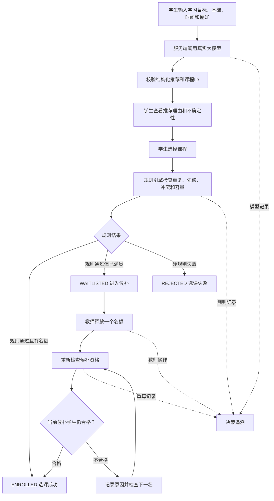

# AI课程选课冲突与候补调整系统：产品需求文档（PRD）

## 1. 文档信息

| 项目 | 内容 |
|---|---|
| 文档阶段 | ② product-prd |
| 版本 | v0.2 |
| 状态 | 已完成范围收敛，待人工确认 |
| 项目周期 | 三人协作，1天薄原型 |
| 目标用户 | 学生、教师/教务人员 |
| 上游输入 | `01_project-flow-map.md`、题目要求、三人分工方案 |
| 下游文档 | `03_design-options.md` |
| 核心原则 | 大模型负责理解、推荐和解释；确定性规则负责资格、公平和状态变更 |

> 本PRD只定义一天内必须完成的P0闭环。未列入P0的课程管理、审批、并发和通知能力不进入本轮开发。

## 2. 产品背景

学生选课不仅需要考虑学习目标和个人偏好，还会受到先修课程、上课时间、重复选课和课程容量等硬约束影响。课程推荐适合学生，不代表学生当前一定有资格选上；候补排名靠前，也不代表出现空位后一定能够补入。

本项目需要将真实大模型推荐、确定性规则检查、选课与候补状态管理、候补资格重算和决策追溯结合起来，完成一个可以重复演示的最小闭环。

## 3. 产品目标

| 目标 | 可验证结果 |
|---|---|
| 接入真实大模型 | 服务端实际调用模型API，并保存模型名称、推荐来源和追溯编号 |
| 提供可解释推荐 | 每门推荐课程包含已有课程ID、匹配分数、推荐理由和不确定性 |
| 保证资格判断确定 | 重复、先修、时间冲突和容量由固定代码规则判断，不由模型决定 |
| 完成选课与候补闭环 | 规则通过后进入已选或候补，失败时返回具体规则和原因 |
| 演示候补动态调整 | 教师释放一个名额后重新检查候补资格，失效者被跳过，下一名合格者补入 |
| 形成可追溯证据 | 学生输入、模型建议、规则结果、状态变化和教师操作可按`trace_id`查看 |

## 4. 用户主流程



## 5. 需求收敛与优先级

### 5.1 P0：一天内必须完成

| ID | 能力主题 | 核心价值 | 主负责人 |
|---|---|---|---|
| R1 | 学生目标提交与真实大模型推荐 | 证明系统真实接入AI，并提供可解释推荐 | 学生端、服务端 |
| R2 | 确定性规则检查 | 保证推荐不等于可选，判断结果稳定可验证 | 服务端 |
| R3 | 选课与候补状态 | 形成选课成功、进入候补和选课失败三种结果 | 学生端、服务端 |
| R4 | 教师释放名额与候补重算 | 演示状态变化后重新校验和公平递补 | 教师端、服务端 |
| R5 | 决策追溯与失败降级 | 证明结果来源，并覆盖模型失败场景 | 三端共同 |

### 5.2 P1：完成P0后才考虑

- 学生取消候补。
- 推荐结果排序或收藏。
- 教师调整多个课程容量。
- 简单课程统计。
- 大模型生成替代课程说明。

### 5.3 本轮删除或暂缓

| 能力 | 结论 | 原因 |
|---|---|---|
| 完整课程新增、编辑、取消 | 暂缓 | 教师端只需固定课程和释放名额操作 |
| 课程改时后处理所有已选学生 | 暂缓 | 涉及批量状态和待处理流程，超出一天范围 |
| 学生退课完整流程 | 暂缓 | 本轮通过教师“释放一个名额”模拟状态变化 |
| 个人最大选课数量 | 暂缓 | 与核心冲突和候补案例无直接关系 |
| 例外审批 | 暂缓 | 涉及额外`REVIEW`状态和审批记录 |
| 多用户并发抢最后名额 | 删除 | 需要事务和并发控制，与单机薄原型边界冲突 |
| 正式数据库和用户权限 | 删除 | 使用固定模拟数据和内存状态即可完成演示 |
| 消息通知 | 删除 | 不影响核心闭环 |

## 6. 数据与状态契约

### 6.1 核心输入数据

第一版使用固定模拟数据：

- 6至8门课程。
- 3名模拟学生。
- 至少1组时间冲突课程。
- 至少1门满员课程。
- 至少1门课程具有先修要求。
- 至少1个候补第一名失去资格、下一名成功补入的案例。

### 6.2 核心数据对象

| 对象 | 必要字段 |
|---|---|
| `StudentProfile` | `student_id`、`goal`、`skills`、`available_times`、`completed_course_ids`、`enrolled_course_ids` |
| `Course` | `course_id`、`name`、`description`、`schedule`、`capacity`、`enrolled_count`、`prerequisite_ids`、`status` |
| `Recommendation` | `course_id`、`score`、`reason`、`uncertainty`、`source` |
| `RuleCheckResult` | `rule`、`passed`、`reason`、`related_course_id` |
| `EnrollmentDecision` | `student_id`、`course_id`、`status`、`checks`、`trace_id` |
| `WaitlistEntry` | `student_id`、`course_id`、`position`、`status`、`last_check_reason` |
| `TraceEvent` | `trace_id`、`event_type`、`actor`、`input`、`output`、`created_at` |

### 6.3 状态枚举

规则判断、选课状态和候补状态必须分开，禁止混用。

| 枚举 | 可用值 | 说明 |
|---|---|---|
| `RuleDecision` | `PASS`、`BLOCK` | 硬规则整体判断 |
| `EnrollmentStatus` | `ENROLLED`、`WAITLISTED`、`REJECTED` | 学生针对课程的最终业务状态 |
| `WaitlistStatus` | `WAITING`、`PROMOTED`、`SKIPPED` | 候补记录在本次原型中的状态 |

状态映射：

```text
RuleDecision = BLOCK
→ EnrollmentStatus = REJECTED

RuleDecision = PASS 且课程有名额
→ EnrollmentStatus = ENROLLED

RuleDecision = PASS 且课程满员
→ EnrollmentStatus = WAITLISTED
→ WaitlistStatus = WAITING
```

## 7. 正式需求与验收标准

### R1：学生目标提交与真实大模型推荐

学生输入自然语言学习目标、已有基础、可上课时间和课程偏好。服务端将学生信息和固定课程目录发送给真实大模型，要求模型只从目录中推荐课程，并返回结构化结果。

每门有效推荐至少包含：

- `course_id`
- `score`，范围为0至100
- `reason`
- `uncertainty`
- `source`，值为`model`或`fallback`

**AC-R1-1**：Given 学生提交非空学习目标和固定课程目录，When 请求推荐，Then 服务端真实调用已配置的大模型，并返回至少1门目录内课程。

**AC-R1-2**：Given 模型正常返回，When 服务端解析结果，Then 每门推荐均包含课程ID、分数、理由、不确定性、`source=model`和`trace_id`。

**AC-R1-3**：Given 模型返回不存在的课程ID或非法JSON，When 服务端校验结果，Then 不得将非法课程展示为有效推荐；系统最多重试一次，失败后进入降级流程并标记`source=fallback`。

**AC-R1-4**：Given 学习目标为空，When 学生提交，Then 系统返回缺失字段提示，且不调用大模型。

**AC-R1-5**：Given 模型请求超时或API失败，When 推荐流程结束，Then 系统返回明确失败或降级信息，不伪装成正常模型结果。

### R2：确定性规则检查

学生选择推荐课程后，服务端按照固定顺序执行硬规则：

```text
重复选课检查
→ 先修课程检查
→ 时间冲突检查
→ 课程容量检查
```

硬规则由代码执行，大模型不能覆盖规则结果。

**AC-R2-1**：Given 学生已选择目标课程，When 再次提交同一课程，Then 返回`BLOCK`，原因包含重复选课。

**AC-R2-2**：Given 学生缺少课程要求的先修课程，When 执行检查，Then 返回`BLOCK`，原因包含缺失课程ID或名称。

**AC-R2-3**：Given 目标课程与学生已选课程时间重叠，When 执行检查，Then 返回`BLOCK`，原因包含冲突课程。

**AC-R2-4**：Given 重复、先修和冲突检查均通过，When 课程仍有容量，Then规则返回`PASS`并允许进入已选状态。

**AC-R2-5**：Given 重复、先修和冲突检查均通过，When 课程已满，Then规则返回`PASS`，业务状态进入候补，而不是规则失败。

### R3：选课与候补状态

服务端根据R2结果生成统一业务状态，并将结果返回学生端。

**AC-R3-1**：Given 规则通过且课程有名额，When 学生确认选课，Then返回`ENROLLED`并更新模拟课程已选人数。

**AC-R3-2**：Given 规则通过但课程已满，When 学生确认，Then返回`WAITLISTED`，新增一条`WAITING`候补记录并展示排名。

**AC-R3-3**：Given 任一硬规则失败，When 学生提交选课，Then返回`REJECTED`及具体规则结果，不新增已选或候补记录。

**AC-R3-4**：Given 同一学生已处于某课程候补队列，When 重复提交，Then不得创建重复候补记录。

**AC-R3-5**：Given 每次选课或候补操作，When 服务端返回结果，Then必须同时返回`trace_id`，供学生查看决策过程。

### R4：教师释放名额与候补重算

教师端展示固定课程、已选人数、候补名单和候补顺序，并提供“释放一个名额”和“重新计算候补”操作。

**AC-R4-1**：Given 一门满员课程存在候补名单，When 教师释放一个名额，Then服务端计算出1个可用名额并启动候补重算。

**AC-R4-2**：Given 候补第一名在等待期间新增了一门时间冲突课程，When 重新检查资格，Then第一名状态变为`SKIPPED`并记录冲突原因。

**AC-R4-3**：Given 第一名被跳过且第二名资格有效，When 重算继续，Then第二名状态变为`PROMOTED`，业务状态变为`ENROLLED`。

**AC-R4-4**：Given 可用名额已经用完，When 重算继续，Then系统停止补入，不改变其余候补顺序。

**AC-R4-5**：Given 重算完成，When 教师和学生查看结果，Then两端展示一致的课程人数、候补状态和补入结果。

### R5：决策追溯与失败降级

系统为推荐、规则检查、选课、候补和教师重算生成统一追溯记录。

追溯至少包含：

- 学生原始输入。
- 模型名称与Prompt版本。
- 模型推荐或降级结果。
- 每项规则检查结果。
- 选课或候补最终状态。
- 教师释放名额操作。
- 候补检查顺序、跳过原因和递补结果。
- 操作时间和操作角色。

**AC-R5-1**：Given 任意一次推荐和选课流程，When 使用`trace_id`查询，Then能够查看学生输入、AI建议、规则结果和最终状态。

**AC-R5-2**：Given 模型调用失败并使用降级结果，When 查看追溯记录，Then明确显示失败原因和`source=fallback`。

**AC-R5-3**：Given 候补第一名被跳过，When 查看追溯记录，Then能够看到重新检查的规则、失败原因和下一名补入结果。

**AC-R5-4**：Given 教师执行释放名额操作，When 查看追溯记录，Then包含操作角色、课程ID、操作前后状态和处理结果。

## 8. 页面范围

### 8.1 学生端：一个页面

学生端只做一个页面或一个连续流程，包含：

- 学习目标、基础、时间和偏好输入。
- 获取AI推荐按钮和加载状态。
- 推荐课程卡片。
- 推荐分数、理由、不确定性和来源。
- 选择课程按钮。
- 规则检查结果。
- `ENROLLED`、`WAITLISTED`、`REJECTED`状态。
- 候补排名。
- 决策追溯时间线。

### 8.2 教师端：一个页面

教师端只做一个简化控制面板，包含：

- 固定课程及当前容量。
- 已选人数。
- 已选学生和候补名单。
- 候补顺序和当前状态。
- 释放一个名额按钮。
- 重新计算候补按钮。
- 被跳过学生及原因。
- 最终递补结果。
- 教师操作追溯。

## 9. 最小接口范围

| 接口 | 调用方 | 作用 |
|---|---|---|
| `POST /api/recommend` | 学生端 | 调用大模型并返回结构化课程推荐 |
| `POST /api/enroll` | 学生端 | 执行规则检查并返回选课、候补或失败状态 |
| `GET /api/student/status` | 学生端 | 查看当前已选课程、候补状态和排名 |
| `GET /api/admin/course-status` | 教师端 | 查看固定课程、已选和候补名单 |
| `POST /api/admin/release-seat` | 教师端 | 为指定课程模拟释放一个名额 |
| `POST /api/admin/recompute-waitlist` | 教师端 | 重新检查候补资格并完成递补 |
| `GET /api/trace/{trace_id}` | 学生端、教师端 | 查看推荐、规则和状态变化记录 |

接口字段和错误码在`03_design-options.md`阶段确定。本PRD只固定业务含义和验收结果。

## 10. 四个固定验收场景

### 场景一：正常推荐并选课成功

```text
学生提交有效目标
→ 大模型推荐目录内课程
→ 规则全部通过
→ 课程有剩余容量
→ 返回ENROLLED
```

### 场景二：推荐课程发生时间冲突

```text
大模型推荐目录内课程
→ 学生提交选课
→ 规则发现与已选课程时间冲突
→ 返回REJECTED和冲突原因
```

### 场景三：课程满员后进入候补

```text
学生资格检查通过
→ 课程容量已满
→ 返回WAITLISTED
→ 创建WAITING候补记录并展示排名
```

### 场景四：候补第一名失效，下一名成功递补

```text
教师释放一个名额
→ 重新检查候补第一名
→ 第一名因新选课程发生时间冲突而SKIPPED
→ 继续检查第二名
→ 第二名资格有效并PROMOTED
→ 第二名业务状态变为ENROLLED
```

四个场景必须使用固定模拟数据重复执行，页面结果、服务端状态和追溯记录必须一致。

## 11. 非功能需求

| ID | 要求 | 验收方式 |
|---|---|---|
| NFR-1 | API Key安全 | Key只保存在服务端环境变量中，前端代码和返回数据均不包含Key |
| NFR-2 | 模型输出安全 | 模型结果经过结构化校验和课程ID白名单检查后才能返回前端 |
| NFR-3 | 确定性 | 同一学生、课程和规则状态应得到相同规则判断结果 |
| NFR-4 | 可追溯性 | 每个关键操作返回`trace_id`，可查询输入、输出和状态变化 |
| NFR-5 | 失败可见 | 模型超时、非法输出和降级推荐必须明确标记，不能静默伪装成功 |
| NFR-6 | 可演示性 | 四个固定场景可在本地重复运行，不依赖真实教务数据 |
| NFR-7 | 前后端一致性 | 学生端、教师端和服务端共用相同状态枚举及Mock数据契约 |

## 12. Non-goals

- 不接入真实学校教务系统和真实学生数据。
- 不实现注册、登录、角色权限和账号管理。
- 不处理多人同时抢最后一个名额的并发事务。
- 不实现完整课程新增、删除、改时和取消流程。
- 不实现学生退课完整流程，本轮使用教师释放名额模拟状态变化。
- 不实现最大选课数量限制和培养方案审核。
- 不实现例外审批和`REVIEW`状态。
- 不实现消息通知、支付、统计看板和推荐收藏。
- 不训练、微调或评估新的推荐模型。
- 不建设正式数据库；可使用JSON、SQLite或内存状态。
- 不将本原型作为生产教务系统部署。

## 13. 风险与决策记录

| 项目 | 风险/问题 | 当前建议 | 状态 |
|---|---|---|---|
| 大模型不稳定 | 超时、非法JSON或虚构课程 | 结构化校验、课程ID白名单、最多重试一次，之后明确降级 | 待确认 |
| 推荐与资格不一致 | 模型可能推荐时间冲突或满员课程 | 保留推荐，由确定性规则在选课时拒绝或进入候补 | 待确认 |
| 三端字段不一致 | Mock与真实接口字段不同会拖慢联调 | 开发前冻结Schema和状态枚举 | 待确认 |
| 候补公平性 | 第一名失效后可能错误停止 | 按顺序逐人重检，直到名额用完或队列结束 | 待确认 |
| 服务端工作量较重 | 模型、规则、状态和追溯均在服务端 | 前端负责人承担各自Mock、联调和场景测试；严格执行Non-goals | 待确认 |
| 模型服务不可用 | 现场无法完成真实调用 | 保留已验证的调用记录，并准备明确标记的fallback演示 | 待确认 |

## 14. PRD完成定义

- [x] 已将需求收敛为R1至R5五条P0能力。
- [x] 已为每条正式需求定义可验证AC。
- [x] 已统一规则、选课和候补状态枚举。
- [x] 已增加真实大模型调用和输出校验要求。
- [x] 已删除并发、完整CRUD、复杂审批和多事件重算。
- [x] 已固定四个验收场景。
- [x] 已定义数据契约、非功能需求和Non-goals。
- [ ] 三名成员已确认工作量和接口边界。
- [ ] 人工已批准进入`03_design-options.md`阶段。

## 15. 人工确认记录

| 确认项 | 结论 | 确认人 | 日期 | 备注 |
|---|---|---|---|---|
| R1-R5与验收标准 | 待确认 | — | 2026-07-16 | 确认五条P0覆盖一天原型核心闭环 |
| 状态枚举与业务映射 | 待确认 | — | 2026-07-16 | 确认三类枚举不会被前后端混用 |
| 四个固定验收场景 | 待确认 | — | 2026-07-16 | 确认场景覆盖正常、边界、失败和重算 |
| Non-goals | 待确认 | — | 2026-07-16 | 确认不扩展并发、CRUD、审批和通知 |
| 是否进入方案设计阶段 | 待批准 | — | 2026-07-16 | PRD确认后进入`03_design-options.md` |
