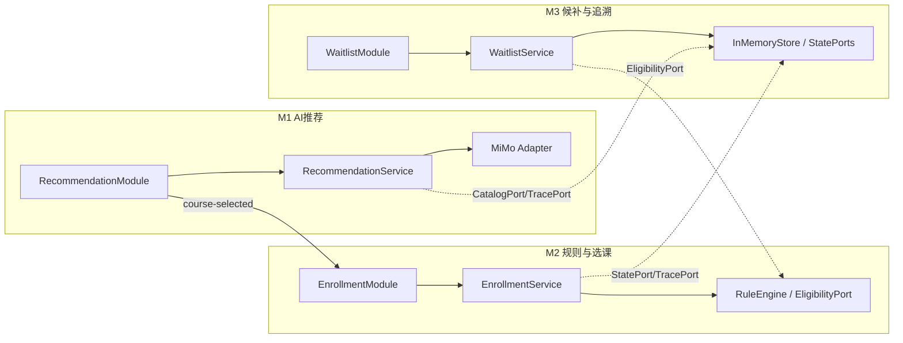

# AI课程选课冲突与候补调整系统：三模块并行开发计划

## 1. 文档信息

| 项目 | 内容 |
|---|---|
| 文档阶段 | ④ dev-workflow |
| 版本 | v0.2 |
| 状态 | 待人工确认，尚未进入编码 |
| 项目周期 | 三人协作，1天薄原型 |
| 上游输入 | `product-prd.md`、`03_design-options.md` |
| 下游文档 | `05_test-strategy.md` |
| 最终方案 | S2：Vue 3 + TypeScript前端、FastAPI后端、JSON种子数据和内存状态 |
| 大模型供应商 | MiMo；允许明确标记的fallback，但正式验收至少成功调用一次MiMo |

## 2. 拆分原则

本计划不按“学生端、教师端、服务端”技术层拆分，而按三个可以独立运行、独立测试、最终可组合的业务能力模块拆分：

| 模块 | 业务能力 | 独立运行结果 | 集成后作用 | 预计工作量 |
|---|---|---|---|---:|
| M1 AI推荐模块 | 学生需求输入、MiMo调用、结构化校验、fallback、推荐展示 | 输入学生目标即可得到合法课程推荐 | 为M2提供被选择的`student_id + course_id` | 约6小时 |
| M2 规则与选课模块 | 重复、先修、冲突检查，容量分流，选课/候补结果展示 | 手动选择固定课程即可得到`ENROLLED/WAITLISTED/REJECTED` | 接收M1选择，向M3写入已选或候补状态 | 约6小时 |
| M3 候补重算与追溯模块 | 内存Store、候补队列、释放名额、资格重检、追溯展示 | 使用固定候补数据即可演示第一名跳过、第二名补入 | 为M1/M2提供真实状态和追溯事实来源 | 约7小时 |

三个模块都是纵向切片：每个模块同时包含必要的前端组件、后端服务、测试和独立演示入口。执行人只需要阅读本文档和共享契约即可完成一个模块，不需要等待另外两个模块先实现。

## 3. 可合并性的核心规则

1. 三个模块不直接导入另一个模块的具体实现，只依赖Step 0冻结的接口和数据对象。
2. 每个模块对外只有一个后端Router、一个业务Service和一个前端入口组件。
3. 每个模块在独立运行时使用Fake/Stub依赖；合并时由`bootstrap.py`注入真实实现。
4. M1不直接调用M2；M1前端只发出`course-selected`事件。
5. M2不直接实现存储；M2通过`StatePort`读写学生、课程、选课和候补状态。
6. M3不复制M2规则；M3通过`EligibilityPort`在补入前重新检查资格。
7. 共享枚举、Schema、事件和接口路径由Step 0冻结，任何模块不得自行添加同名不同义字段。
8. 独立演示通过后才允许合并；合并后只修改组合入口，不重写模块内部代码。
9. Mock、Fake和Stub只能用于独立开发和失败测试；正式V1验收必须真实调用MiMo。
10. 任何真实执行前，文档中的结果保持“待执行”，不得预填通过。

## 4. Step 0：冻结共享契约

Step 0由三人共同完成，控制在30分钟内。完成后立即从同一提交创建三个分支并行开发。

### 4.1 共享目录

```text
contracts/
|-- openapi.yaml
|-- domain.schema.json
|-- enums.json
|-- frontend-events.ts
|-- examples/
|   |-- recommend-model.json
|   |-- recommend-fallback.json
|   |-- enroll-enrolled.json
|   |-- enroll-waitlisted.json
|   |-- enroll-rejected.json
|   |-- recompute-result.json
|   `-- trace.json
`-- CHANGELOG.md
```

`contracts/`是三模块唯一共享事实来源。前端TypeScript类型和后端Pydantic模型必须与该目录一致。

### 4.2 冻结的领域对象

#### StudentProfile

```json
{
  "student_id": "S001",
  "goal": "学习人工智能并完成实践项目",
  "skills": ["Python"],
  "available_times": ["TUE_EVENING", "THU_EVENING"],
  "completed_course_ids": ["C001"],
  "enrolled_course_ids": ["C002"]
}
```

#### Course

第一版每门课程只设置一个时间段，避免复杂排课模型。

```json
{
  "course_id": "C003",
  "name": "机器学习基础",
  "description": "机器学习核心概念与实践",
  "schedule": {
    "day": "TUE",
    "start": "19:00",
    "end": "21:00"
  },
  "capacity": 2,
  "enrolled_count": 2,
  "prerequisite_ids": ["C001"],
  "status": "OPEN"
}
```

#### RecommendationResponse

```json
{
  "trace_id": "trace-rec-001",
  "source": "MODEL",
  "model": "configured-mimo-model",
  "prompt_version": "v1",
  "recommendations": [
    {
      "course_id": "C003",
      "score": 92,
      "reason": "符合人工智能学习目标，且具备Python基础",
      "uncertainty": "尚未确认数学基础"
    }
  ]
}
```

#### EnrollmentDecision

容量是分配条件，不把“满员”当作资格失败：

```json
{
  "trace_id": "trace-enroll-001",
  "student_id": "S001",
  "course_id": "C003",
  "rule_decision": "PASS",
  "capacity_available": false,
  "status": "WAITLISTED",
  "waitlist_position": 2,
  "checks": [
    {"rule": "DUPLICATE", "passed": true, "reason": "未重复选课"},
    {"rule": "PREREQUISITE", "passed": true, "reason": "已满足先修要求"},
    {"rule": "TIME_CONFLICT", "passed": true, "reason": "无时间冲突"}
  ]
}
```

#### RecomputeResult

```json
{
  "trace_id": "trace-recompute-001",
  "course_id": "C003",
  "available_seats_before": 1,
  "checked": [
    {
      "student_id": "S001",
      "waitlist_status": "SKIPPED",
      "reason": "与C002时间冲突"
    },
    {
      "student_id": "S002",
      "waitlist_status": "PROMOTED",
      "reason": "资格有效并成功补入"
    }
  ],
  "promoted_student_ids": ["S002"]
}
```

### 4.3 冻结的枚举

```text
RuleDecision         = PASS | BLOCK
EnrollmentStatus     = ENROLLED | WAITLISTED | REJECTED
WaitlistStatus       = WAITING | PROMOTED | SKIPPED
RecommendationSource = MODEL | FALLBACK
CourseStatus         = OPEN | CANCELLED
RuleName             = DUPLICATE | PREREQUISITE | TIME_CONFLICT
```

### 4.4 冻结的后端Ports

三个模块只能通过下列抽象协作。Python实现可使用`typing.Protocol`。

```python
class CatalogPort(Protocol):
    def list_courses(self) -> list[Course]: ...
    def get_course(self, course_id: str) -> Course: ...

class StatePort(Protocol):
    def get_student(self, student_id: str) -> StudentProfile: ...
    def get_enrolled_course_ids(self, student_id: str) -> list[str]: ...
    def save_enrolled(self, student_id: str, course_id: str) -> None: ...
    def save_waitlisted(self, student_id: str, course_id: str) -> int: ...
    def list_waitlist(self, course_id: str) -> list[WaitlistEntry]: ...
    def release_seat(self, course_id: str) -> None: ...

class EligibilityPort(Protocol):
    def evaluate(self, student_id: str, course_id: str) -> EligibilityResult: ...

class TracePort(Protocol):
    def create(self, event_type: str, payload: dict) -> str: ...
    def append(self, trace_id: str, event_type: str, payload: dict) -> None: ...
    def get(self, trace_id: str) -> list[TraceEvent]: ...
```

独立开发时：

- M1使用`FakeCatalogPort`和`FakeTracePort`。
- M2使用`FakeStatePort`和`FakeTracePort`。
- M3使用`FakeEligibilityPort`。

合并后：

- M3的`InMemoryStore`实现`CatalogPort + StatePort + TracePort`。
- M2的`RuleEngine`实现`EligibilityPort`。
- `bootstrap.py`将真实实现注入三个模块。

### 4.5 冻结的前端事件

```typescript
export interface CourseSelectedEvent {
  studentId: string;
  courseId: string;
  recommendationTraceId: string;
}

export interface EnrollmentDecidedEvent {
  studentId: string;
  courseId: string;
  status: "ENROLLED" | "WAITLISTED" | "REJECTED";
  enrollmentTraceId: string;
}
```

- M1的`RecommendationModule.vue`发出`course-selected`。
- M2的`EnrollmentModule.vue`接收`CourseSelectedEvent`并发出`enrollment-decided`。
- M3的`WaitlistModule.vue`不依赖前两个组件，可按课程ID独立刷新状态。
- 最终`App.vue`只负责转发事件和排列组件，不包含业务逻辑。

### 4.6 Step 0完成门禁

- [x] 上述5类领域对象已写入Schema并通过样例校验。
- [x] 枚举与`product-prd.md`完全一致。
- [x] 4个Ports的方法签名已在本文冻结。
- [x] 2个前端事件已写入共享契约。
- [x] OpenAPI包含三个模块的8个固定接口。
- [ ] 三人确认各自模块只依赖Ports和契约，不导入其他模块实现。
- [ ] 共享契约提交哈希已记录。

## 5. 项目结构与所有权

```text
project/
|-- contracts/                              # Step 0共同冻结
|-- frontend/
|   |-- src/
|   |   |-- modules/
|   |   |   |-- recommendation/             # M1独占
|   |   |   |-- enrollment/                 # M2独占
|   |   |   `-- waitlist/                   # M3独占
|   |   |-- integration/
|   |   |   `-- App.vue                     # 最终合并阶段创建
|   |   |-- shared/                         # 由契约生成/Step 0冻结
|   |   `-- main.ts                         # 支持standalone/integration模式
|   |-- tests/
|   |   |-- recommendation/                 # M1独占
|   |   |-- enrollment/                     # M2独占
|   |   `-- waitlist/                       # M3独占
|   `-- package.json
|-- backend/
|   |-- app/
|   |   |-- contracts/                      # 由契约生成/Step 0冻结
|   |   |-- modules/
|   |   |   |-- recommendation/             # M1独占
|   |   |   |-- enrollment/                 # M2独占
|   |   |   `-- waitlist/                   # M3独占
|   |   |-- integration/
|   |   |   `-- bootstrap.py                # 最终合并阶段创建
|   |   `-- main.py                         # 只挂载三个模块Router
|   `-- tests/
|       |-- recommendation/                 # M1独占
|       |-- enrollment/                     # M2独占
|       `-- waitlist/                       # M3独占
|-- data/
|   |-- scenarios.json                      # Step 0冻结
|   |-- courses.json                        # Step 0冻结
|   `-- students.json                       # Step 0冻结
|-- .env.example                            # Step 0只写变量名
`-- README.md                               # 最终合并阶段共同完成
```

每个模块拥有自己的前端、后端和测试目录，因此三个分支合并时通常不会修改同一文件。`integration/App.vue`和`integration/bootstrap.py`在三个模块完成前保持空壳，最终集成时按本文档固定代码接线。

## 6. 预定环境与通用命令

开始开发时记录实际环境版本，不在计划阶段声称依赖已安装。

```powershell
node --version
npm --version
python --version
```

前端通用命令：

```powershell
npm --prefix frontend install
npm --prefix frontend run test
npm --prefix frontend run build
```

后端通用命令：

```powershell
python -m pip install -r backend/requirements.txt
python -m pytest backend/tests -q
```

环境变量只保存变量名，不提交真实值：

```text
MIMO_API_KEY=
MIMO_BASE_URL=
MIMO_MODEL=
MIMO_TIMEOUT_SECONDS=
FRONTEND_ORIGIN=http://localhost:5173
```

## 7. M1：AI推荐模块

### 7.1 模块交付契约

| 项目 | 内容 |
|---|---|
| 输入 | `StudentProfile`、`CatalogPort`、MiMo配置、`TracePort` |
| 输出 | `RecommendationResponse`、`course-selected`前端事件 |
| 后端接口 | `POST /api/recommend` |
| 前端入口 | `RecommendationModule.vue` |
| 独立后端 | `python -m uvicorn app.modules.recommendation.demo:app --port 8101` |
| 独立前端 | `VITE_ACTIVE_MODULE=recommendation`模式 |
| 对应需求 | R1、R5中的推荐和模型失败追溯 |

### A1：先写契约和组件测试，建立Red

**后端测试**：

- 合法MiMo响应转换为`RecommendationResponse`。
- 非法JSON触发一次重试。
- 目录外课程ID被拒绝或过滤。
- 超时后返回`source=FALLBACK`和失败原因。
- API Key不出现在响应或追溯载荷中。

**前端测试**：

- `MODEL`显示“AI推荐 · MiMo”。
- `FALLBACK`显示“降级推荐”和失败原因。
- 推荐卡显示课程ID、分数、理由和不确定性。
- 点击课程发出符合契约的`course-selected`事件。

```powershell
python -m pytest backend/tests/recommendation -q
npm --prefix frontend run test -- recommendation
```

预期Red：测试正常收集，因M1目标模块尚不存在或行为缺失而失败。

### A2：实现MiMo适配器和结构化校验

- 从环境变量读取MiMo配置。
- 只向模型发送学生资料和固定课程目录。
- 使用Pydantic校验结构化输出。
- 使用`CatalogPort`进行课程ID白名单检查。
- 失败最多重试一次，之后进入明确fallback。
- 通过`TracePort`写入模型名称、Prompt版本、来源和失败原因。

### A3：实现推荐Router和独立Demo

- 提供`POST /api/recommend`。
- Demo注入`FakeCatalogPort`和`FakeTracePort`。
- Demo不得依赖M2或M3目录。
- 使用Stub MiMo响应跑通正常与fallback两种情况。

### A4：实现推荐前端组件

- 输入学生目标、基础、时间和偏好。
- 展示加载、错误、MiMo和fallback状态。
- 发出冻结的`course-selected`事件，不直接进入选课状态。

### A5：M1独立完成门禁

- [ ] 后端推荐测试全部通过。
- [ ] 前端推荐测试全部通过。
- [ ] 8101端口可独立返回推荐响应。
- [ ] 正常模型和fallback均可独立演示。
- [ ] 目录外课程不能进入结果。
- [ ] API Key不进入响应、日志或前端。
- [ ] `RecommendationModule.vue`只通过事件输出课程选择。
- [ ] M1没有导入M2或M3具体实现。

## 8. M2：规则与选课模块

### 8.1 模块交付契约

| 项目 | 内容 |
|---|---|
| 输入 | `student_id + course_id`、`StatePort`、`TracePort` |
| 输出 | `EnrollmentDecision`、`EnrollmentDecidedEvent` |
| 后端接口 | `POST /api/enroll`、`GET /api/student/status` |
| 后端能力 | `RuleEngine`实现`EligibilityPort` |
| 前端入口 | `EnrollmentModule.vue` |
| 独立后端 | `python -m uvicorn app.modules.enrollment.demo:app --port 8102` |
| 独立前端 | `VITE_ACTIVE_MODULE=enrollment`模式，使用手动课程选择 |
| 对应需求 | R2、R3、R5中的规则和选课追溯 |

### B1：先写规则、状态和组件测试，建立Red

**后端测试**：

- 重复选课返回`BLOCK/REJECTED`。
- 缺少先修返回`BLOCK/REJECTED`和缺失课程。
- 时间重叠返回`BLOCK/REJECTED`和冲突课程。
- 资格通过且有容量返回`PASS/ENROLLED`。
- 资格通过但满员返回`PASS/WAITLISTED`并获得排名。
- 重复候补不创建第二条记录。
- 同一输入的规则结果确定且规则引擎不修改状态。

**前端测试**：

- 接收`CourseSelectedEvent`后显示目标课程。
- 显示逐条规则结果。
- 正确显示三种业务状态和候补排名。
- 发出符合契约的`EnrollmentDecidedEvent`。

```powershell
python -m pytest backend/tests/enrollment -q
npm --prefix frontend run test -- enrollment
```

### B2：实现纯规则引擎

规则引擎只检查资格：

```text
DUPLICATE
→ PREREQUISITE
→ TIME_CONFLICT
→ RuleDecision PASS或BLOCK
```

容量由选课Service读取并决定`ENROLLED`或`WAITLISTED`，不得把满员返回为`BLOCK`。

### B3：实现选课Service、Router和独立Demo

- Service通过`StatePort`读取学生、课程和当前选课。
- `BLOCK`不写入任何状态。
- `PASS + 有容量`调用`save_enrolled()`。
- `PASS + 满员`调用`save_waitlisted()`。
- 每次操作通过`TracePort`保存检查与最终状态。
- Demo注入`FakeStatePort`和`FakeTracePort`，使用固定课程手动测试，不依赖M1推荐。

### B4：实现选课前端组件

- 独立模式允许从固定课程下拉框选择课程。
- 集成模式接收M1的`CourseSelectedEvent`。
- 所有判断结果来自后端响应，前端不复制规则。
- 发出`EnrollmentDecidedEvent`，但不直接调用M3实现。

### B5：M2独立完成门禁

- [ ] 规则、状态和接口测试全部通过。
- [ ] 前端选课测试全部通过。
- [ ] 8102端口可独立返回三种业务状态。
- [ ] 冲突、先修、重复和满员场景可独立演示。
- [ ] `RuleEngine`实现冻结的`EligibilityPort`。
- [ ] 满员时资格为`PASS`、业务状态为`WAITLISTED`。
- [ ] M2只依赖`StatePort/TracePort`，没有导入M3 Store。
- [ ] M2没有导入M1推荐实现。

## 9. M3：候补重算与追溯模块

### 9.1 模块交付契约

| 项目 | 内容 |
|---|---|
| 输入 | JSON种子数据、`EligibilityPort`、教师释放名额操作 |
| 输出 | `RecomputeResult`、课程状态、候补队列、追溯事件 |
| 后端接口 | `GET /api/admin/course-status`、`POST /api/admin/release-seat`、`POST /api/admin/recompute-waitlist`、`GET /api/trace/{trace_id}`、`POST /api/demo/reset` |
| 后端能力 | `InMemoryStore`实现`CatalogPort + StatePort + TracePort` |
| 前端入口 | `WaitlistModule.vue`、`TraceTimeline.vue` |
| 独立后端 | `python -m uvicorn app.modules.waitlist.demo:app --port 8103` |
| 独立前端 | `VITE_ACTIVE_MODULE=waitlist`模式 |
| 对应需求 | R4、R5及所有状态事实来源 |

### C1：先写Store、候补和组件测试，建立Red

**后端测试**：

- JSON种子数据只读，reset恢复相同状态。
- 释放一个名额后可用名额正确。
- 第一名资格有效时补入并停止。
- 第一名失效时标记`SKIPPED`并继续检查第二名。
- 第二名有效时标记`PROMOTED`并增加课程人数。
- 没有空位时不改变队列。
- 追溯包含释放、重检、跳过和补入事件。

**前端测试**：

- 展示课程容量、人数和候补顺序。
- 点击释放名额只发送请求，不在前端先改人数。
- 重算结果展示检查顺序、跳过原因和补入学生。
- 追溯时间线按时间显示事件。

```powershell
python -m pytest backend/tests/waitlist -q
npm --prefix frontend run test -- waitlist
```

### C2：实现内存Store和TracePort

- 只读加载`courses.json`、`students.json`和`scenarios.json`。
- 启动或reset时深拷贝种子状态。
- 实现`CatalogPort + StatePort + TracePort`全部方法。
- 进程重启后状态允许丢失，但种子文件不得被覆盖。
- 同一个状态更新由Service一次完成，避免课程人数和候补记录不一致。

### C3：实现候补重算Service

- 通过注入的`EligibilityPort`重新检查每名候补学生。
- 独立模式使用`FakeEligibilityPort`返回固定资格结果。
- 严格保留原申请顺序。
- 失效者记录`SKIPPED`和原因后继续。
- 合格者记录`PROMOTED`并调用Store写入已选。
- 名额用完或队列结束时停止。

### C4：实现教师Router、追溯Router和独立Demo

- 提供课程状态、释放名额、重算、追溯和reset接口。
- Demo使用`FakeEligibilityPort`，不依赖M2已经完成。
- reset按`scenario_id`恢复固定演示场景。

### C5：实现候补与追溯前端组件

- 展示课程、容量、已选和候补列表。
- 发起释放名额与重算请求。
- 显示第一名跳过、第二名补入。
- 展示来自`TracePort`的事件，不自行拼接虚假追溯。

### C6：M3独立完成门禁

- [x] Store、候补、追溯和接口测试全部通过。
- [x] 前端候补测试全部通过。
- [x] 8103端口可独立演示释放名额和重算。
- [x] 第一名跳过后继续检查下一名。
- [x] 课程人数、已选记录和候补状态一致。
- [x] reset不修改种子JSON。
- [x] M3实现冻结的`CatalogPort + StatePort + TracePort`。
- [x] M3只依赖`EligibilityPort`，没有复制M2规则。

## 10. 三模块依赖图



虚线依赖在独立模式下由Fake替代，合并后由`bootstrap.py`连接真实实现。

## 11. 三分支并行策略

```text
main（包含Step 0共享契约和空壳组合入口）
|-- feature/recommendation-module
|-- feature/enrollment-module
`-- feature/waitlist-module
```

| 分支 | 唯一可修改目录 |
|---|---|
| `feature/recommendation-module` | 前后端`modules/recommendation/`及对应测试 |
| `feature/enrollment-module` | 前后端`modules/enrollment/`及对应测试 |
| `feature/waitlist-module` | 前后端`modules/waitlist/`及对应测试 |

如果模块发现契约缺失：

1. 在自己的分支停止新增私有字段。
2. 提交契约变更说明，包括字段、原因和影响模块。
3. 三人确认后先修改`main`中的契约。
4. 三个分支同步该契约提交后再继续。

## 12. 模块独立交付包

每名执行人合并前必须提交：

- 模块前端源码。
- 模块后端源码。
- 前后端模块测试。
- 独立Demo入口和运行命令。
- Fake/Stub实现，只能放在模块的`demo/`或测试目录。
- 测试Red→Green实际记录。
- 修改文件清单。
- 已知限制和未完成项。
- 对外导出的Router、Service、组件和Port实现说明。

缺少独立Demo或测试证据的模块不得进入合并阶段。

## 13. 固定合并与接线方案

### 13.1 合并顺序

三个模块在开发上完全并行；合并顺序只用于降低冲突和排错成本：

1. 合并M3，因为它提供真实`CatalogPort + StatePort + TracePort`。
2. 合并M2，因为它提供真实`EligibilityPort`和选课Service。
3. 合并M1，因为它只消费Catalog/Trace并输出课程选择事件。
4. 创建组合入口，连接真实Ports和三个前端组件。
5. 删除或禁止生产入口引用Fake/Stub。

### 13.2 后端组合入口

`backend/app/integration/bootstrap.py`只做依赖注入：

```python
store = InMemoryStore.from_seed(data_dir)

rule_engine = RuleEngine(state=store)

recommendation_service = RecommendationService(
    catalog=store,
    trace=store,
    llm=MiMoAdapter.from_env(),
)

enrollment_service = EnrollmentService(
    eligibility=rule_engine,
    state=store,
    trace=store,
)

waitlist_service = WaitlistService(
    eligibility=rule_engine,
    state=store,
    trace=store,
)
```

`backend/app/main.py`只挂载三个Router：

```python
app.include_router(recommendation_router)
app.include_router(enrollment_router)
app.include_router(waitlist_router)
```

组合入口不得新增硬规则、状态转换或fallback逻辑。

### 13.3 前端组合入口

`frontend/src/integration/App.vue`只负责组件组合和事件转发：

```vue
<RecommendationModule @course-selected="selectedCourse = $event" />
<EnrollmentModule
  :selection="selectedCourse"
  @enrollment-decided="latestDecision = $event"
/>
<WaitlistModule :latest-decision="latestDecision" />
```

组件组合不得复制模块内部业务逻辑。M3教师面板可以独立显示在教师路由，M1和M2组合在学生路由；两条路由共享同一FastAPI状态。

## 14. 集成运行方式

### 14.1 启动

终端一：

```powershell
python -m uvicorn backend.app.main:app --reload --port 8000
```

终端二：

```powershell
$env:VITE_ACTIVE_MODULE="integration"
$env:VITE_API_BASE_URL="http://localhost:8000"
npm --prefix frontend run dev
```

访问：

- 学生主流程：`http://localhost:5173/student`
- 教师候补流程：`http://localhost:5173/teacher`
- FastAPI接口文档：`http://localhost:8000/docs`

### 14.2 自动验证

```powershell
python -m pytest backend/tests -q
npm --prefix frontend run test
npm --prefix frontend run build
```

### 14.3 禁止残留的独立模式依赖

合并后必须检查：

- 生产`bootstrap.py`没有导入`FakeCatalogPort`、`FakeStatePort`、`FakeEligibilityPort`或`FakeTracePort`。
- 正式Router没有使用Stub MiMo响应。
- 正式前端没有从`contracts/examples/`直接读取结果。
- M1、M2、M3共享同一个`InMemoryStore`实例。
- M2选课写入的候补记录能被M3立即读取。
- M3重算后的`ENROLLED`状态能被M2学生状态接口读取。

## 15. 四个集成验收场景

| 场景 | 跨模块路径 | 预期结果 |
|---|---|---|
| V1 正常推荐并选课成功 | M1真实MiMo推荐 → M1发出课程选择 → M2规则检查 → M3保存状态 | 页面显示“AI推荐 · MiMo”，最终`ENROLLED`，追溯包含模型、规则和状态 |
| V2 推荐课程发生时间冲突 | M1推荐 → M2检查到与已选课程冲突 | 返回`BLOCK/REJECTED`，M3不写入已选或候补 |
| V3 满员后进入候补 | M1推荐 → M2资格通过但发现满员 → M3保存候补 | 返回`PASS/WAITLISTED/WAITING`，教师面板能读取该记录 |
| V4 第一名失效、第二名补入 | M3释放名额 → M3调用M2`EligibilityPort`逐人重检 | 第一名`SKIPPED`，第二名`PROMOTED/ENROLLED`，状态和追溯一致 |

额外失败验证：MiMo超时后M1重试一次并返回`FALLBACK`；页面明确显示“降级推荐”，但该场景不能替代V1真实MiMo成功调用。

## 16. Red—Green执行记录模板

不得预填真实结果；每名执行人在完成对应Step时实时更新。

| 模块 | 阶段 | 命令 | 预期 | 实际 | 状态 | 证据/备注 |
|---|---|---|---|---|---|---|
| M1 | Red | M1前后端测试 | 因推荐模块缺失而失败 | 待执行 | 待执行 | — |
| M1 | Green | M1前后端测试与独立Demo | 推荐、校验、fallback和UI通过 | 待执行 | 待执行 | — |
| M2 | Red | M2前后端测试 | 因规则/选课模块缺失而失败 | 待执行 | 待执行 | — |
| M2 | Green | M2前后端测试与独立Demo | 规则、状态和UI通过 | 待执行 | 待执行 | — |
| M3 | Red | `pytest`与`vitest`候补测试 | 因Store/候补组件尚不存在而失败 | 后端2个收集错误；前端2个测试文件导入失败 | 已完成 | `ModuleNotFoundError: app`；两个Vue组件不存在 |
| M3 | Green | 后端全测、前端候补测试、build、8103 HTTP冒烟 | Store、候补、追溯和UI通过 | 后端14项、前端4项通过；冻结OpenAPI响应校验通过；build成功；S002跳过、S005补入 | 已完成 | 2026-07-16，详见`project/M3_WAITLIST_MODULE.md` |
| 集成 | Verify | 后端全测、前端全测、build、V1—V4 | 三模块真实接线后全部通过 | 待执行 | 待执行 | — |

## 17. 集成完成门禁

- [ ] 三个模块均有独立Demo和真实测试输出。
- [ ] 三个分支均未修改其他模块目录。
- [ ] 共享契约没有未记录的分叉版本。
- [ ] 组合入口只做依赖注入和组件接线。
- [ ] 正式运行不引用任何Fake/Stub或静态Mock结果。
- [ ] M1成功调用至少一次真实MiMo。
- [ ] M1课程选择可以直接驱动M2选课。
- [ ] M2写入的已选/候补状态可以被M3读取。
- [ ] M3重算时调用M2真实`EligibilityPort`。
- [ ] M3重算结果可以通过M2学生状态接口读取。
- [ ] V1—V4均可在reset后重复执行。
- [ ] fallback明确标记，且没有替代V1。
- [ ] 前端全测、后端全测和前端build通过。
- [ ] API Key没有进入仓库、前端或响应。

## 18. AI自审、人工审查与回滚

### 18.1 AI自审

- 模块是否只依赖冻结的契约和Ports。
- 是否导入了其他模块具体实现。
- Fake/Stub是否只存在于测试或Demo入口。
- 前端是否复制了硬规则或直接修改业务状态。
- MiMo是否可能返回目录外课程。
- 满员是否被错误判断为`BLOCK`。
- 候补第一名失败后是否继续检查下一名。
- 三模块是否最终共享同一个Store和Trace事实来源。
- 是否增加PRD明确删除的并发、CRUD或审批功能。
- 是否有真实命令输出，而不是只声称通过。

### 18.2 人工审查

| 审查点 | 人工重点 | 不通过时动作 |
|---|---|---|
| Step 0 | Ports、事件和Schema是否足以支持三模块独立开发 | 停止并行，先修订契约 |
| M1完成 | 推荐是否合法、MiMo/fallback是否真实区分 | 返回M1，不修改M2/M3适配错误结果 |
| M2完成 | 规则是否确定、满员是否正确进入候补 | 返回M2，补充规则和状态测试 |
| M3完成 | Store一致性、候补重检和追溯是否完整 | 返回M3，补充重算测试 |
| 合并后 | 是否只在组合入口接线、是否残留Fake | No-Go，清除独立模式依赖后重验 |
| 最终场景 | V1—V4状态是否可重复、证据是否完整 | 缺失项保持未完成，不得虚假放行 |

### 18.3 回滚

- Step 0契约单独提交，三个模块从同一提交创建分支。
- 一个模块失败时只回滚该模块，不修改另两个已完成模块。
- 契约变化必须先更新主分支契约，再同步三个分支。
- 模块合并导致问题时按M3→M2→M1的逆序定位，组合入口不承载临时补丁。
- MiMo异常时保留真实失败记录并进入已批准fallback，不删除真实调用代码。
- 内存状态污染时使用`/api/demo/reset`恢复种子场景，不手改运行中数据。
- PRD变化必须先更新PRD和方案文档，再建立新的Red测试。

## 19. 计划完成定义

- [x] 已按AI推荐、规则选课、候补追溯拆成三个业务能力模块。
- [x] 每个模块均包含前端、后端、测试和独立Demo入口。
- [x] 已定义共享Schema、Ports、事件和模块所有权。
- [x] 已定义独立模式Fake与集成模式真实实现的替换规则。
- [x] 已给出固定合并顺序和前后端组合入口示例。
- [x] 已定义三模块之间的输入输出和双向状态可见性。
- [x] 已定义四个跨模块集成场景和集成完成门禁。
- [x] 未伪造任何Red、Green或集成结果。
- [ ] 三名成员已确认各自选择的能力模块。
- [x] Step 0共享契约文件已创建并完成本地格式与样例校验。
- [ ] Step 0共享契约已由三人确认并提交到共同代码仓库。
- [ ] 具体MiMo模型名称和调用配置已确认。
- [ ] 人工已批准按本文进入编码。

## 20. 人工确认记录

| 确认项 | 结论 | 确认人 | 日期 | 备注 |
|---|---|---|---|---|
| 能力模块拆分 | 待确认 | — | 2026-07-16 | M1推荐、M2规则选课、M3候补追溯 |
| 共享Ports与事件 | 待确认 | — | 2026-07-16 | 模块只依赖契约，不导入彼此实现 |
| 独立Demo策略 | 待确认 | — | 2026-07-16 | 每个模块使用Fake独立运行 |
| 真实组合策略 | 待确认 | — | 2026-07-16 | bootstrap注入Store、RuleEngine和MiMo适配器 |
| 合并顺序 | 待确认 | — | 2026-07-16 | M3→M2→M1，最后只修改组合入口 |
| V1—V4集成门禁 | 待确认 | — | 2026-07-16 | 验证推荐→选课→候补→重算完整闭环 |
| 是否允许进入编码 | 待批准 | — | 2026-07-16 | 契约和MiMo配置完成后开始三分支并行 |
