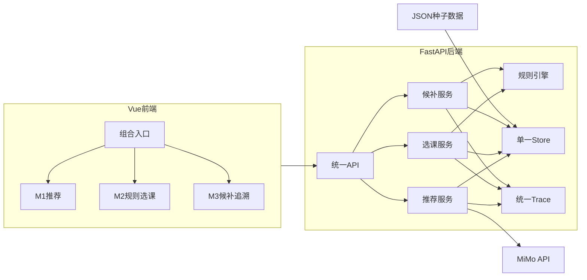

# 端到端系统设计

## 1. 总体结构

系统由一个Vue应用、一个FastAPI服务、固定JSON数据和一个运行期内存Store组成。



## 2. 模块职责

| 模块 | 输入 | 输出 | 边界 |
|---|---|---|---|
| M1推荐 | 学生目标、基础、偏好和课程目录 | 推荐、理由、不确定性、来源和Trace | 不判断资格，不写选课状态 |
| M2规则选课 | 学生、课程和当前状态 | 逐条规则、三种选课状态和Trace | 不调用模型，不改变候补顺序 |
| M3候补追溯 | 课程、候补、名额和M2资格结果 | 跳过、补入、课程状态和Trace | 不复制M2规则 |

## 3. 端到端数据流

```text
StudentProfile
→ POST /api/recommend
→ RecommendationResponse
→ CourseSelectedEvent
→ POST /api/enroll
→ EnrollmentDecision
→ WAITLISTED时写入共享Store
→ GET /api/admin/course-status
→ POST /api/admin/release-seat
→ POST /api/admin/recompute-waitlist
→ RecomputeResult
→ GET /api/trace/{trace_id}
```

## 4. 状态设计

| 状态层次 | 值 | 说明 |
|---|---|---|
| 规则结论 | `PASS`、`BLOCK` | 是否满足硬规则 |
| 选课状态 | `ENROLLED`、`WAITLISTED`、`REJECTED` | 学生针对课程的业务结果 |
| 候补状态 | `WAITING`、`PROMOTED`、`SKIPPED` | 候补记录的处理结果 |
| 推荐来源 | `MODEL`、`FALLBACK` | 真实模型或降级路径 |

满员不产生`BLOCK`。规则通过后，选课服务根据容量决定`ENROLLED`或`WAITLISTED`。

## 5. MiMo设计

1. 后端读取学生信息和固定课程目录。
2. MiMo返回结构化推荐。
3. 服务端验证JSON字段、分数和课程ID。
4. 非法结果最多重试一次。
5. 重试失败后返回明确的fallback。
6. Key始终保存在后端环境变量中。

## 6. 候补重算设计

```text
读取可用名额
→ 按原申请顺序读取WAITING记录
→ 调用M2真实规则检查当前资格
→ 有效：PROMOTED并写入ENROLLED
→ 失效：SKIPPED并保存原因
→ 仍有名额时继续下一名
→ 记录完整Trace
```

等待人数只统计`WAITING`。`PROMOTED`和`SKIPPED`保留在已处理记录中，既不会继续占用等待人数，也不会丢失处理历史。

## 7. 一致性设计

- 正式组合入口只创建一个Store。
- M1、M2、M3使用同一个Trace来源。
- 前端不自行实现硬规则。
- 教师页面不直接修改候补顺序。
- reset从只读种子重新建立运行状态。
- 共享接口和枚举以`project/contracts/`为准。

## 8. 当前限制

内存Store不支持跨进程持久化和并发事务；释放名额使用容量加1模拟；没有权限、真实退课、批量课程变更和生产部署。这些内容属于本轮明确边界。

