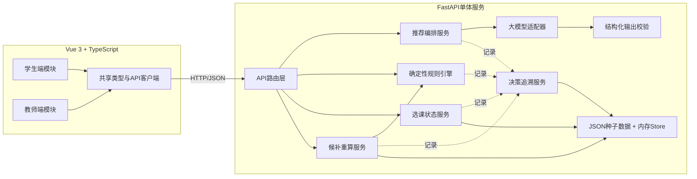
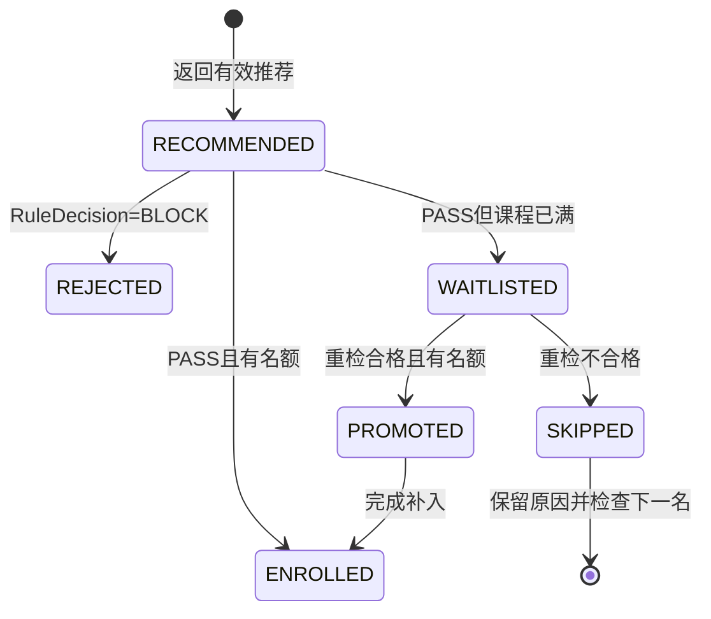
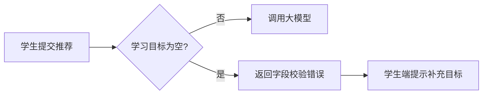
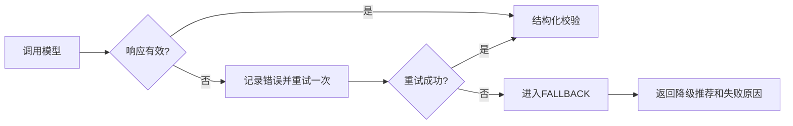
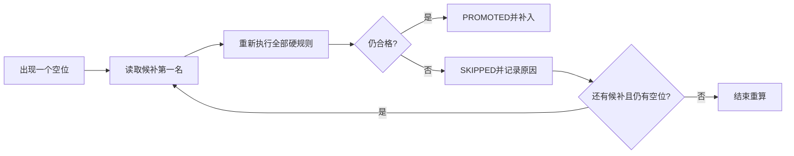

# AI课程选课冲突与候补调整系统：技术方案对比选型

## 1. 文档信息

| 项目 | 内容 |
|---|---|
| 文档阶段 | ③ design-options |
| 版本 | v0.1 |
| 状态 | S2、MiMo供应商、内存状态和fallback演示策略已确认；具体模型名称待确认 |
| 项目周期 | 三人协作，1天薄原型 |
| 上游输入 | `01_project-flow-map.md`、`product-prd.md` |
| 下游文档 | `04_dev-workflow.md` |

## 2. 设计约束

- 必须真实调用大模型API，不能使用固定推荐文案冒充模型结果。
- 大模型负责理解、推荐和解释，不负责最终资格判断、候补顺序或状态变更。
- 模型只能推荐固定课程目录中存在的课程ID，输出必须经过服务端结构化校验。
- 重复选课、先修、时间冲突和课程容量必须由确定性代码规则判断。
- 必须支持`ENROLLED`、`WAITLISTED`、`REJECTED`三种选课状态。
- 教师释放一个名额后，必须重新检查候补资格；第一名失效时继续检查下一名。
- 学生输入、模型结果、规则结果和教师操作必须能够通过`trace_id`追溯。
- API Key只能保存在服务端环境变量中，不得进入前端代码或浏览器请求。
- 学生端、教师端和服务端需要并行开发，接口和Mock数据必须在开发前冻结。
- 系统使用模拟课程和学生数据，不实现登录、正式数据库、完整CRUD或并发抢课。
- 四个固定验收场景必须可以重置并重复演示。

## 3. AI发散：5个候选方案

| 编号 | 方案 | 核心做法 | 估算成本 | 主要效果 | 具体风险 | 初筛 |
|---|---|---|---:|---|---|---|
| S1 | 纯前端原型，浏览器直连大模型 | Vue页面直接调用模型API，选课和候补规则写在前端内存中 | 10—13人时 | 开发最快、页面联调简单 | API Key暴露；学生端和教师端容易各写一套规则；无法形成可信服务端 | 排除 |
| S2 | Vue双角色前端 + FastAPI单体后端 | 一个Vue项目包含学生/教师模块；一个FastAPI服务集中处理模型、规则、状态和追溯；JSON种子数据+内存状态 | 17—20人时 | 完整覆盖R1—R5，安全边界清楚，适合三人并行 | 单体内模块若不隔离，服务端负责人容易超载；内存状态不适合生产 | 深入比较/推荐 |
| S3 | 前端 + 模型/规则/状态三个微服务 | 将大模型、规则引擎和候补状态拆成独立服务，通过HTTP或消息通信 | 28—36人时 | 边界清晰、未来扩展性强 | 服务发现、跨服务错误、部署和数据一致性成本远超一天范围 | 深入比较 |
| S4 | Vue双角色前端 + TypeScript全栈单体 | Vue + Node.js/Fastify，前后端共享TypeScript类型；服务端调用模型并执行规则 | 17—21人时 | 类型共享好，前后端语言一致，联调成本低 | 大模型结构化处理和规则测试取决于团队Node熟练度；后端成员当前更适合Python | 深入比较 |
| S5 | LLM代理统一决定推荐、冲突和候补 | 将学生、课程和候补信息全部交给大模型，由模型输出最终结果 | 12—16人时 | 演示“AI感”强，规则代码少 | 输出不确定、候补不公平、不可重复，直接违反AI/规则边界 | 排除 |

## 4. 人工收敛：5 → 3

保留S2、S3、S4进行深入比较：S2代表适合一天交付的Python单体方案，S3代表模块边界最清晰但成本较高的服务化方案，S4代表前后端统一语言的替代方案。S1因API Key和规则可信度问题排除，S5因违反确定性规则和候补公平原则排除。

| 维度 | 权重 | S2 FastAPI单体 | S3 三微服务 | S4 TypeScript全栈 |
|---|---:|---:|---:|---:|
| R1—R5覆盖度 | 25% | 5 | 5 | 5 |
| 一天内可完成性 | 25% | 5 | 2 | 4 |
| 规则确定性与候补公平 | 15% | 5 | 5 | 5 |
| 三人并行与联调成本 | 15% | 4 | 2 | 4 |
| 模型密钥与输出安全 | 10% | 5 | 5 | 4 |
| 结果追溯能力 | 10% | 5 | 5 | 4 |
| 加权总分（满分5） | 100% | **4.85** | **3.50** | **4.40** |

评分说明：5表示最符合当前项目，1表示明显不符合。S3在长期扩展上有优势，但一天内的部署和跨服务状态成本过高；S4具备良好的类型共享能力，但团队需要同时处理Node大模型调用和状态逻辑。S2能够以最少运行单元覆盖全部P0能力，并符合当前推荐的Python后端、TypeScript前端分工。

## 5. 最终推荐：S2

推荐采用“Vue双角色前端 + FastAPI单体后端 + JSON种子数据/内存状态 + 统一追溯”的方案。

该方案的“单体”只表示一个后端进程，不表示所有逻辑写在同一个文件。服务端内部必须按大模型、规则、状态、候补和追溯进行模块隔离。

### 5.1 总体架构



### 5.2 项目结构

```text
project/
|-- frontend/
|   |-- src/
|   |   |-- student/
|   |   |   |-- StudentFlow.vue
|   |   |   |-- RecommendationList.vue
|   |   |   `-- StudentTrace.vue
|   |   |-- teacher/
|   |   |   |-- CourseStatus.vue
|   |   |   |-- WaitlistPanel.vue
|   |   |   `-- RecomputeResult.vue
|   |   |-- shared/
|   |   |   |-- api.ts
|   |   |   |-- types.ts
|   |   |   `-- status.ts
|   |   `-- App.vue
|   `-- package.json
|-- backend/
|   |-- app/
|   |   |-- main.py
|   |   |-- config.py
|   |   |-- api/
|   |   |   |-- recommend.py
|   |   |   |-- enrollment.py
|   |   |   |-- admin.py
|   |   |   `-- trace.py
|   |   |-- schemas/
|   |   |   |-- student.py
|   |   |   |-- course.py
|   |   |   |-- recommendation.py
|   |   |   `-- decision.py
|   |   |-- llm/
|   |   |   |-- client.py
|   |   |   |-- prompts.py
|   |   |   |-- validator.py
|   |   |   `-- recommender.py
|   |   |-- rules/
|   |   |   |-- duplicate.py
|   |   |   |-- prerequisite.py
|   |   |   |-- conflict.py
|   |   |   |-- capacity.py
|   |   |   `-- engine.py
|   |   |-- services/
|   |   |   |-- enrollment.py
|   |   |   |-- waitlist.py
|   |   |   |-- trace.py
|   |   |   `-- demo_reset.py
|   |   |-- store/
|   |   |   `-- memory.py
|   |   `-- data/
|   |       |-- courses.json
|   |       `-- students.json
|   |-- tests/
|   |   |-- test_rules.py
|   |   |-- test_waitlist.py
|   |   |-- test_llm_validation.py
|   |   `-- test_api_flow.py
|   `-- requirements.txt
|-- .env.example
`-- README.md
```

目录归属：

- 学生端负责人独占`frontend/src/student/`，并参与`shared/types.ts`首次确认。
- 教师端负责人独占`frontend/src/teacher/`，并负责固定课程、学生和候补演示数据。
- 服务端负责人独占`backend/`。
- `frontend/src/shared/`的数据结构在开发开始前由三人共同冻结，之后变更必须同步通知三端。

### 5.3 模块边界

| 模块 | 输入 | 输出 | 禁止行为 |
|---|---|---|---|
| 学生端 | 学生输入、推荐和决策响应 | 推荐卡片、规则结果、业务状态、追溯时间线 | 不保存API Key；不在前端复制硬规则；不直接修改选课状态 |
| 教师端 | 课程状态、候补队列、重算结果 | 释放名额请求、重算请求、递补展示 | 不在前端修改候补顺序；不绕过服务端直接改变学生状态 |
| API路由层 | HTTP请求 | 统一JSON响应和错误码 | 不承载复杂规则；不直接操作底层字典 |
| 推荐编排服务 | `StudentProfile`、课程目录 | 通过校验的`Recommendation[]` | 不把模型推荐直接写成选课结果 |
| 大模型适配器 | Prompt、课程目录、学生信息 | 原始模型响应 | 不读取前端传入的模型名称或API Key；不判断硬规则 |
| 输出校验器 | 原始模型响应、课程ID集合 | 合法推荐或校验错误 | 不保留目录外课程；不静默吞掉非法输出 |
| 规则引擎 | 学生、目标课程、当前选课 | `RuleDecision`及逐条检查 | 不调用大模型；不修改业务状态；同一输入必须得到同一结果 |
| 选课状态服务 | 规则结果、容量、当前状态 | `ENROLLED`、`WAITLISTED`或`REJECTED` | 不跳过规则引擎；不创建重复选课或重复候补 |
| 候补重算服务 | 空位数、候补队列、最新学生状态 | 跳过/补入事件和新队列 | 不把原始排名等同于资格；不在第一名失败后停止 |
| 追溯服务 | 各模块事件 | `trace_id`及时间线 | 不修改业务决定；不把fallback标成正常模型输出 |
| 内存Store | JSON种子数据、状态更新 | 当前演示状态 | 不承担并发一致性；不被前端直接访问 |

### 5.4 依赖选择

| 任务 | 选择 | 理由 |
|---|---|---|
| 学生端/教师端 | Vue 3 + TypeScript + Vite | 一天内快速完成表单、卡片、状态和双角色模块 |
| HTTP调用 | 原生`fetch`或团队已有Axios | 只保留一种，避免重复封装 |
| 服务端 | Python + FastAPI | 路由清晰、自带接口文档，适合模型和规则服务 |
| 数据校验 | Pydantic | 同时校验前端请求、模型输出和API响应 |
| 大模型调用 | 已选供应商官方SDK或OpenAI-compatible客户端 | API Key留在服务端，并通过适配器隔离供应商差异 |
| 状态存储 | JSON只读种子 + Python内存Store | 支持快速开发和场景重置，避免数据库迁移成本 |
| 服务端测试 | pytest | 规则、候补和接口流程可使用固定输入精确断言 |

大模型供应商已确认为MiMo，具体模型名称应在开发前补充，并通过环境变量配置；业务代码只能依赖统一的`recommend(profile, catalog)`接口，避免将供应商调用细节扩散到推荐编排和规则模块。

## 6. 核心数据与状态策略

### 6.1 数据事实来源

- `courses.json`和`students.json`是演示种子数据，只读加载，不在运行中覆盖。
- 应用启动或执行演示重置时，将种子数据深拷贝到内存Store。
- 当前选课、候补和追溯记录只存在于单个后端进程内。
- 页面只通过API读取和修改状态，禁止直接读取JSON文件。
- 每个固定场景使用明确的`scenario_id`，重置后应回到相同初始状态。

### 6.2 状态枚举

| 类别 | 枚举值 | 说明 |
|---|---|---|
| `RuleDecision` | `PASS`、`BLOCK` | 硬规则总体结果 |
| `EnrollmentStatus` | `ENROLLED`、`WAITLISTED`、`REJECTED` | 学生针对课程的业务状态 |
| `WaitlistStatus` | `WAITING`、`PROMOTED`、`SKIPPED` | 候补记录状态 |
| `RecommendationSource` | `MODEL`、`FALLBACK` | 推荐来自真实模型还是降级逻辑 |

### 6.3 状态转换



`SKIPPED`只表示该候补记录在本次递补中因资格失效被跳过，不表示系统可以修改其原始申请时间或让后续学生永久插队。

## 7. 接口契约建议

| 接口 | 关键输入 | 关键输出 |
|---|---|---|
| `POST /api/recommend` | 学生目标、基础、时间、偏好 | 推荐数组、`source`、模型信息、`trace_id` |
| `POST /api/enroll` | `student_id`、`course_id` | 逐条规则检查、`EnrollmentStatus`、候补排名、`trace_id` |
| `GET /api/student/status` | `student_id` | 已选课程、候补记录、最新状态 |
| `GET /api/admin/course-status` | `course_id` | 容量、已选名单、候补顺序与状态 |
| `POST /api/admin/release-seat` | `course_id` | 操作前后容量/人数、`trace_id` |
| `POST /api/admin/recompute-waitlist` | `course_id` | 检查顺序、跳过原因、补入结果、`trace_id` |
| `GET /api/trace/{trace_id}` | `trace_id` | 按时间排序的模型、规则和状态事件 |
| `POST /api/demo/reset` | `scenario_id` | 重置后的课程、学生和候补摘要 |

### 7.1 推荐响应示例

```json
{
  "trace_id": "trace-001",
  "source": "MODEL",
  "model": "configured-model",
  "prompt_version": "v1",
  "recommendations": [
    {
      "course_id": "C003",
      "score": 92,
      "reason": "符合人工智能学习目标，且学生具备Python基础",
      "uncertainty": "尚未确认学生的数学基础"
    }
  ]
}
```

### 7.2 选课响应示例

```json
{
  "trace_id": "trace-002",
  "student_id": "S001",
  "course_id": "C003",
  "rule_decision": "BLOCK",
  "status": "REJECTED",
  "checks": [
    {"rule": "duplicate", "passed": true, "reason": "未重复选课"},
    {"rule": "prerequisite", "passed": true, "reason": "已满足先修要求"},
    {
      "rule": "time_conflict",
      "passed": false,
      "reason": "与C002上课时间冲突",
      "related_course_id": "C002"
    }
  ]
}
```

接口的完整字段、HTTP状态码和错误码在开发开始前冻结；前端Mock响应必须直接复制正式响应结构。

## 8. Happy Path

1. 三人使用同一份Schema和JSON种子数据启动学生端、教师端和FastAPI服务。
2. 学生输入学习目标、已有基础、可上课时间和偏好。
3. 服务端从环境变量读取API Key，调用真实大模型并传入固定课程目录。
4. Pydantic校验模型JSON，过滤目录外课程，返回有效推荐和`trace_id`。
5. 学生选择一门推荐课程，服务端按重复、先修、时间冲突和容量顺序检查。
6. 规则通过但课程已满，学生进入`WAITLISTED/WAITING`状态并看到候补排名。
7. 教师端查看该课程和候补名单，点击“释放一个名额”。
8. 教师触发重算，服务端重新检查候补第一名；第一名因新冲突变为`SKIPPED`。
9. 服务端继续检查第二名，第二名合格并变为`PROMOTED/ENROLLED`。
10. 学生端、教师端显示一致结果，并可通过`trace_id`查看模型、规则、教师操作和重算过程。

## 9. Failure Paths

### FP-1：学生目标为空



控制规则：空目标不得调用模型，不产生伪推荐，也不写入选课状态。

### FP-2：模型超时、API失败或非法JSON



控制规则：降级结果必须标记`source=FALLBACK`，追溯记录必须保留模型失败原因，不得伪装成正常模型输出。

### FP-3：模型返回不存在的课程ID

- 校验器使用服务端课程ID集合进行白名单检查。
- 目录外课程不得返回前端，也不得进入选课接口。
- 若过滤后仍有合法推荐，可以返回合法部分并记录告警。
- 若过滤后为空，按FP-2重试一次或进入降级流程。

### FP-4：学生选中冲突课程

- 模型仍可推荐符合学习目标但时间冲突的课程。
- 学生提交选课后，规则引擎返回`BLOCK`。
- 业务状态返回`REJECTED`，不创建选课或候补记录。
- 响应和追溯中必须包含冲突课程ID和原因。

### FP-5：候补第一名失去资格



控制规则：不得因第一名不合格而停止整个重算；不得改变未检查候补的原始申请顺序。

### FP-6：前后端Schema或状态值不一致

- FastAPI/Pydantic拒绝未知字段组合和非法枚举，返回可读校验错误。
- 前端只从`shared/types.ts`引用状态值，不自行拼写字符串。
- 接口校验失败不得修改内存Store。
- 变更Schema时必须同步更新前端Mock、接口示例和测试fixture。

### FP-7：现场演示状态被前一次操作污染

- 使用`POST /api/demo/reset`按`scenario_id`重新加载种子数据。
- 重置仅用于本地演示，不属于生产接口。
- 重置后课程人数、候补顺序和预期结果必须与固定场景一致。

## 10. 具体风险与控制

| 风险 | 触发方式 | 后果 | 控制与验证 |
|---|---|---|---|
| API Key泄露 | 前端直接调用模型或提交Key | 凭证暴露、无法安全演示 | Key只存在服务端环境变量；扫描前端构建产物和仓库 |
| 模型编造课程 | Prompt约束无效或模型输出漂移 | 展示不存在课程，后续选课失败 | 课程ID白名单、Pydantic校验、非法结果测试 |
| 模型输出不稳定 | 不同调用返回格式不同 | 前端解析失败、演示中断 | 结构化输出、最多重试一次、明确fallback |
| 推荐与资格混用 | 把推荐分数当作可选资格 | 绕过先修、冲突或容量 | 推荐接口只返回建议；选课接口强制调用规则引擎 |
| 前后端状态不一致 | 三人各自定义状态字符串 | 页面显示与服务端不同 | 冻结枚举；共享类型；契约测试 |
| 候补处理不公平 | 第一名失效后停止或直接修改排名 | 空位浪费或顺序被破坏 | 循环重检测试；保留原申请顺序和跳过原因 |
| 重算后人数不一致 | 先改候补再改课程人数，或部分更新 | 学生端和教师端状态矛盾 | 状态服务统一提交一次内存更新；接口集成断言 |
| 服务端工作量超载 | 同时开发模型、规则、状态、追溯 | 一天内无法交付 | 模块隔离；前端承担Mock/场景；严格执行Non-goals |
| 演示状态不可重复 | 上一场景修改了内存数据 | 下一场景结果不可预测 | 固定`scenario_id`和演示重置接口 |

## 11. 测试边界建议

设计阶段至少预留以下测试：

| 测试类别 | 最小测试内容 |
|---|---|
| 模型校验单测 | 合法JSON、非法JSON、目录外课程ID、超时fallback |
| 规则单测 | 重复、缺少先修、时间冲突、有容量、已满员 |
| 候补单测 | 第一名合格、第一名失效后第二名补入、无空位停止 |
| 状态单测 | `PASS/BLOCK`到业务状态的映射 |
| API集成测试 | 推荐→选课→候补→释放名额→重算→追溯 |
| 前端验收 | 四个固定场景的状态、原因和追溯展示 |

完整测试用例和AC映射在`05_test-strategy.md`中定义。

## 12. AI与人工决策

| 项目 | AI产出 | 人工必须确认 |
|---|---|---|
| 5个方案 | 候选架构、成本、效果和风险 | 是否认可排除S1和S5 |
| 3个深入方案 | 加权评分和适用边界 | 权重、评分及是否接受S3/S4风险 |
| 最终方案 | 推荐S2 FastAPI单体方案 | 最终5→3→1选型 |
| 大模型供应商 | 统一适配器和环境变量方案 | 已确认供应商为MiMo；具体模型名称、账号与成本仍需补充 |
| 状态存储 | JSON种子数据+内存Store | 已接受进程重启后运行状态丢失，并通过场景重置恢复种子数据 |
| 失败降级 | 重试一次和fallback设计 | 已确认允许fallback作为故障备用，但不得替代真实MiMo主流程，且页面和追溯必须明确标记 |
| 候补规则 | 按原始顺序逐人重检 | 候补顺序和`SKIPPED`业务含义 |

## 13. 设计完成定义

- [x] 已发散5个不同技术方案。
- [x] 已筛选3个方案进行成本、效果和具体风险比较。
- [x] 已推荐1个最终方案并说明理由。
- [x] 已定义模块结构、职责边界和禁止行为。
- [x] 已定义数据事实来源、状态枚举和状态转换。
- [x] 已提供Happy Path和至少3条Failure Path。
- [x] 已定义模型校验、候补重算和演示重置策略。
- [x] 已给出最小接口契约和响应示例。
- [x] 人工已批准采用S2。
- [x] 人工已确认大模型供应商为MiMo。
- [ ] 人工已确认具体模型名称。
- [x] 人工已接受内存状态在进程重启后丢失。
- [x] 人工已确认允许fallback作为故障备用，但不能替代真实MiMo主流程。

## 14. 人工确认记录

| 确认项 | 结论 | 日期 | 备注 |
|---|---|---|---|
| 5→3筛选 | 已确认 | 2026-07-16 | 已确认排除S1浏览器直连模型方案和S5由大模型统一决定资格、冲突与候补的方案，保留S2、S3、S4进行深入比较。 |
| 最终选择S2 | 已批准 | 2026-07-16 | 已确认采用Vue 3 + TypeScript双角色前端、FastAPI单体后端、JSON种子数据与内存Store、统一`trace_id`追溯的S2方案。 |
| 成本/效果/风险矩阵 | 已确认 | 2026-07-16 | 已确认S2在R1—R5覆盖度、一天内可完成性、规则确定性、联调成本、密钥安全和追溯能力之间最符合当前项目约束；S3和S4不作为本轮最终方案。 |
| 大模型供应商与模型 | 部分确认 | 2026-07-16 | 已确认供应商采用MiMo，并通过服务端环境变量和统一适配器接入；具体模型名称仍待开发前补充确认。 |
| 状态存储方式 | 已确认 | 2026-07-16 | 已确认采用JSON只读种子数据加内存Store，接受进程重启后运行状态丢失，并通过固定`scenario_id`和重置接口恢复演示初始状态。 |
| fallback演示策略 | 已确认 | 2026-07-16 | 已确认模型异常时允许重试一次并进入明确标记的fallback；fallback仅作为故障备用，不能替代至少一次真实MiMo成功调用。 |
| Failure Paths | 已确认 | 2026-07-16 | 已确认覆盖空输入、模型超时或非法JSON、目录外课程、时间冲突、候补第一名失效、前后端Schema不一致和演示状态污染等失败路径。 |
| 是否进入开发流程文档 | 已批准并已进入 | 2026-07-16 | 已批准以本方案为上游依据进入`04_dev-workflow.md`，后续开发按M1 AI推荐、M2规则与选课、M3候补重算与追溯三个业务模块并行实施。 |

## 15. 方案取舍与代价记录

### 15.1 选了什么、放弃了什么

| 决策 | 选择 | 放弃 | 代价 |
|------|------|------|------|
| 架构 | S2 FastAPI单体 | S3微服务、S4 TypeScript全栈 | 单体模块间耦合风险较高；内存状态不可持久化 |
| 前端 | Vue 3 + TypeScript | React、纯HTML | 与后端语言不同（Python vs TypeScript），类型不能共享 |
| 后端 | Python + FastAPI | Node.js、Go | 团队Python更熟练，但前端TypeScript类型需手动同步 |
| 存储 | JSON种子+内存Store | SQLite、PostgreSQL | 进程重启后状态丢失，通过reset恢复 |
| 大模型 | MiMo + 统一适配器 | OpenAI、其他供应商 | 依赖MiMo API可用性，需要fallback策略 |
| 状态管理 | 前端事件转发 | 全局状态管理（Vuex/Pinia） | 简单场景够用，复杂场景可能需要状态管理库 |

### 15.2 选择S2的详细理由

**为什么选S2不选S3（微服务）**：
- S3预估28-36人时，超出一天范围
- 服务发现、跨服务错误处理、部署成本过高
- 一天内不需要独立扩展单个服务
- S2的Port抽象已经提供了模块隔离能力

**为什么选S2不选S4（TypeScript全栈）**：
- S4需要同时处理Node大模型调用和状态逻辑
- 团队后端当前更适合Python
- Pydantic校验能力成熟，适合模型输出校验
- S4的类型共享优势在一天内收益有限

**为什么选S2不选S1（纯前端）**：
- S1的API Key会暴露在浏览器中
- 学生端和教师端容易各写一套规则
- 无法形成可信的服务端判断

**为什么选S2不选S5（LLM统一决策）**：
- S5直接违反"AI只推荐、规则判断资格"的红线
- 候补公平性无法保证
- 输出不确定，不可重复演示

### 15.3 放弃其他方案的代价

| 放弃的方案 | 放弃的收益 | 承担的代价 |
|-----------|-----------|-----------|
| S3微服务 | 边界最清晰、扩展性最强 | 单体模块间需要更严格的Port约束 |
| S4 TypeScript全栈 | 前后端类型共享、语言一致 | 需要手动同步TypeScript和Python类型 |
| SQLite持久化 | 状态不丢失 | 内存状态需通过reset恢复 |
| 完整课程CRUD | 教师可管理课程 | 教师端只做释放名额操作 |
| 学生退课 | 状态变化更自然 | 用教师释放名额模拟 |
| 消息通知 | 用户体验更好 | 不影响核心闭环 |
| 并发控制 | 多用户支持 | 一天内单用户演示足够 |

### 15.4 如果约束改变的调整方案

| 约束变化 | 当前方案的调整 |
|---------|-------------|
| 时间扩展到2天 | 增加SQLite持久化、完整课程CRUD、学生退课流程 |
| 时间扩展到3天 | 增加并发控制、消息通知、推荐排序和收藏 |
| 团队增加到5人 | 可拆分为真正的独立服务，但需要协调部署 |
| 评委要求更高UI | 增加Tailwind CSS、动画、响应式设计 |
| MiMo不可用 | 切换到其他OpenAI-compatible供应商（通过适配器） |
