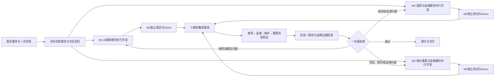
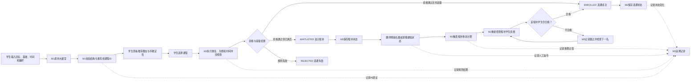

# AI课程选课冲突与候补调整系统：项目全景图

## 1. 文档信息

| 项目   | 内容                                                |
| ---- | ------------------------------------------------- |
| 文档阶段 | ① project-flow-map                                |
| 文档目的 | 明确系统用户角色、M1/M2/M3业务模块、阶段输入输出、交付物、交接边界及大模型/规则/人工分工 |
| 项目周期 | 1天薄原型                                             |
| 当前状态 | 待人工确认                                             |
| 后续文档 | `02_product-prd.md`                               |

> 本文只定义项目全景、角色职责和交接规则，不在此阶段确定最终页面样式、模型供应商、接口字段细节或完整测试用例。

## 2. 项目目标与边界

本项目构建一个接入真实大模型的课程推荐、选课冲突检查与候补动态调整原型，面向学生和教师两个角色，完成以下业务闭环：

```text
学生提交学习目标和偏好
→ 大模型推荐课程并说明理由
→ 规则引擎检查先修、冲突、重复选课和容量
→ 返回选课成功、进入候补或选课失败
→ 教师调整课程容量、时间或状态
→ 系统重新检查候补资格并执行递补
→ 学生和教师查看完整决策记录
```

项目成功不取决于页面数量，而取决于主流程、判断触发、失败场景和追溯证据是否完整。全流程必须遵守以下红线：

* 必须真实调用大模型API，不得用静态文案冒充模型调用结果。

* 大模型只负责理解需求、推荐课程和解释理由，不得直接决定选课资格和候补顺序。

* 大模型只能推荐课程目录中真实存在的课程ID，所有模型输出必须经过服务端结构化校验。

* 先修、时间冲突、重复选课、容量和候补顺序必须由确定性规则判断。

* 推荐不等于可选，候补顺序不等于必然获得名额。

* 课程容量、时间或状态发生变化后，必须重新检查候补学生资格。

* 每次结果必须能追溯到学生输入、大模型建议、规则判断和人工操作。

* 正常、边界和失败场景必须能够使用固定模拟数据重复演示。

### 2.1 一天版必须保留

* 一条从学生输入到最终结果的完整主路径。

* 一次真实大模型推荐调用。

* 一组实际生效的硬规则。

* 选课成功、候补和失败三种结果。

* 一次由教师操作触发的候补重算。

* 至少三个边界或失败场景。

* 完整决策追溯。

### 2.2 一天版明确不做

* 注册、登录和正式权限系统。

* 正式教务数据库和真实学生数据。

* 多用户并发选课与事务竞争。

* 完整课程增删改查。

* 消息通知和复杂审批流。

* 模型训练、微调或复杂推荐算法。

* 复杂页面动画和生产级部署。

## 3. 系统角色与模块职责

### 3.1 系统用户角色

| 角色 | 核心使用场景              | 可执行操作                                | 不拥有的权限               |
| -- | ------------------- | ------------------------------------ | -------------------- |
| 学生 | 提交学习目标与偏好，查看推荐并完成选课 | 查看推荐理由、选择课程、查看选课/候补/失败状态、退课、查看个人结果   | 不能直接修改课程容量、候补顺序或规则结果 |
| 教师 | 维护课程运行状态并处理候补变化     | 查看课程与候补队列、调整容量或时间、释放名额、触发候补重算、查看追溯记录 | 不能让大模型绕过先修、冲突等确定性规则  |

说明：学生和教师是系统中的使用角色，不再作为三名成员的开发分工依据。

### 3.2 三个业务能力模块

三名成员不再分别负责学生端、教师端和服务端，而是分别负责一个纵向业务模块。每个模块都包含完成该业务能力所需的前端组件、后端服务、测试和独立演示入口。

| 模块           | 核心职责                                                | 主要决策边界                                     | 主要交付物                                         |
| ------------ | --------------------------------------------------- | ------------------------------------------ | --------------------------------------------- |
| M1 AI推荐模块    | 接收学生目标、基础、时间和偏好；调用大模型；校验结构化结果和课程ID；展示推荐理由、不确定性及降级来源 | 负责推荐输入输出、模型异常处理和课程白名单校验；不决定学生是否可选，也不修改选课状态 | 推荐前端组件、推荐接口与Service、模型适配与fallback、模块测试、独立Demo |
| M2 规则与选课模块   | 执行重复、先修、时间冲突检查；根据容量将结果分流为选课成功、进入候补或拒绝；展示逐条规则结果      | 负责资格规则、规则执行顺序和选课业务状态；不维护独立状态库，不复制候补重算逻辑    | 规则引擎、选课Service与接口、选课前端组件、模块测试、独立Demo          |
| M3 候补重算与追溯模块 | 管理课程、学生、选课和候补状态；处理释放名额；按原顺序重新检查候补资格；保存并展示追溯记录       | 负责状态一致性、候补队列、递补流程和追溯事实；补入资格仍调用M2规则，不自行复制规则 | 内存Store、候补重算Service与接口、教师操作和追溯组件、模块测试、独立Demo  |
| 大模型          | 理解自然语言目标，从固定课程目录中生成推荐及解释                            | 无先修、冲突、容量、候补和例外审批决策权                       | 结构化推荐候选、理由、不确定性和替代建议                          |
| 人工审查者        | 确认需求、模块边界、共享契约、业务规则、验收结果和最终放行                       | 拥有需求取舍、风险接受、例外处理和项目放行权                     | 确认记录、取舍理由、验收结论                                |

### 3.3 模块协作原则

1. M1、M2、M3只通过共同冻结的数据对象、接口、事件和Ports协作。

2. 每个模块都要能够使用Fake或Stub独立运行和测试，不能等待其他模块先开发完成。

3. M1输出课程选择，M2输出选课决定，M3提供真实状态、候补重算和追溯。

4. M3在递补前调用M2提供的资格检查能力，不得复制一套规则。

5. 集成阶段只负责连接三个模块，不得在组合入口新增业务规则。

## 4. 端到端开发流程图



主流程：共同冻结需求与契约 → M1/M2/M3并行开发 → 各模块独立验证 → 三模块集成 → 固定场景测试 → 追溯检查 → 演示交付。

任何模块发现共享字段、状态含义、事件或业务规则不明确，都必须返回共同契约进行确认，不能在本模块中私自新增同名不同义的数据或规则。

## 5. 系统业务闭环



业务上仍然面向学生和教师两个角色，但开发责任按照M1、M2、M3三个纵向模块组织。

## 6. 阶段输入、输出与交接边界

| 阶段              | 负责人                | 输入                | 核心活动                                  | 输出/交付物                                | 大模型/AI可辅助项                  | 必须由人工完成                | 交接门禁                 |
| --------------- | ------------------ | ----------------- | ------------------------------------- | ------------------------------------- | --------------------------- | ---------------------- | -------------------- |
| 1. 项目全景确认       | 三人共同               | 题目要求、一天限制、最低演示要求  | 确定项目目标、用户角色、M1/M2/M3边界、业务红线和非目标       | `01_project-flow-map.md`              | 发散流程、风险和边界候选                | 确认范围、模块拆分和是否进入PRD      | 必须做与不做已明确；模块职责无重叠或缺口 |
| 2. 产品需求定义       | 团队指定主笔，三人评审        | 已确认项目全景           | 定义学生主路径、教师操作、业务规则、优先级和验收标准            | `02_product-prd.md`                   | 草拟用户故事、AC和失败场景              | 做需求取舍，确认P0功能和Non-goals | 每项P0需求有可演示AC；一天内可完成  |
| 3. 方案与共享契约设计    | 三人共同；各模块负责人确认本模块依赖 | PRD、模拟数据需求、模型限制   | 定义数据对象、状态、接口、事件、Ports、Prompt输入输出和异常路径 | `03_design-options.md`、`contracts/`草案 | 生成Schema、接口样例、候选Prompt和错误清单 | 决定规则顺序、状态含义和模块依赖边界     | 三模块能基于同一契约独立开发       |
| 4. M1/M2/M3并行开发 | 三名模块负责人            | 冻结的共享契约、Mock数据    | 每人完成一个纵向模块的前端、后端、测试和独立Demo            | M1、M2、M3模块源码及测试                       | 辅助编码、测试样例和格式检查              | 审查业务正确性、API Key安全和范围控制 | 每个模块可独立启动、独立测试、独立演示  |
| 5. 模块独立验收       | 各模块负责人，其他两人交叉检查    | 模块源码、测试、Fake/Stub | 验证模块输入输出、异常路径和对外契约                    | Red→Green记录、独立Demo、已知限制               | 分析失败原因和契约偏差                 | 确认结果真实、未导入其他模块实现       | 三个模块均通过各自完成门禁        |
| 6. 三模块集成联调      | 三人共同               | 三个已验收模块、真实共享实现    | 连接M1课程选择、M2选课决定、M3状态与重算               | 可运行完整闭环、联调记录                          | 分析接口、事件和状态错误                | 确认组合入口只接线、不新增业务逻辑      | 推荐、选课、候补和重算可以连续运行    |
| 7. 测试与追溯验证      | 三人共同               | 完整闭环、固定场景、追溯记录    | 回放正常、边界和失败场景；检查状态一致性和证据链              | 测试结果、缺陷清单、追溯截图或记录                     | 发散边界用例、检查字段和状态矛盾            | 判断缺陷有效性和是否满足演示要求       | 固定验收场景通过；无关键状态矛盾     |
| 8. 演示与交付        | 三人共同，指定一人组织        | 可运行原型、测试结果、演示脚本   | 按固定数据演示主路径、候补变化和失败恢复                  | 原型、README、演示脚本、最终文档                   | 整理说明和生成演示提纲                 | 实际运行、最终验收和放行           | 主流程可重复运行；结果有证据支持     |

## 7. 关键交接契约

### 7.1 项目全景 → 产品需求

* 必须确认系统用户仍为学生和教师，但开发工作按M1、M2、M3业务模块拆分。

* 必须确认真实大模型调用是否为一天版必选项。

* 必须确认大模型不拥有选课资格和候补顺序决策权。

* 未确认的页面、状态或人工审批需求不得直接进入开发。

### 7.2 产品需求 → 方案设计

* 每条保留需求必须对应可演示的验收标准。

* 必须定义学生主路径和教师候补路径。

* 必须至少定义正常、边界和失败三类场景。

* 必须明确一天版Non-goals，任何模块不得自行扩大范围。

### 7.3 方案设计 → M1/M2/M3并行开发

* 三个模块必须使用同一份学生、课程、选课、候补、状态和追溯Schema。

* Mock、Fake、Stub和真实实现必须遵守同一契约。

* 模块只能依赖冻结的接口、事件和Ports，不得直接导入其他模块的具体实现。

* 共享契约发生变化时，必须由三人确认并同步更新，不允许模块私自扩展字段。

### 7.4 M1 → M2

* M1只输出被学生选择的`student_id + course_id`及推荐追溯信息。

* 推荐和选课必须是两个动作，M1不得直接写入已选或候补状态。

* M1输出的课程ID必须来自固定课程目录，并通过结构化校验。

* 大模型调用失败时必须明确标记推荐来源，不能用静态文案伪装成功。

### 7.5 M2 ↔ M3

* M2负责资格规则和选课决定，通过共享状态接口读取或写入学生、课程、已选和候补状态。

* M3负责真实状态、候补队列和追溯，不能复制M2的资格规则。

* 满员是容量分流结果，不应被M2错误处理为资格失败。

* M3执行候补重算时，必须调用M2提供的资格检查能力重新验证候补学生。

* 候补第一名失效时，M3必须记录原因并继续检查下一名。

### 7.6 模块 → 集成入口

* 前端组合入口只负责组件排列和事件转发。

* 后端组合入口只负责依赖注入和Router挂载。

* 集成入口不得新增硬规则、状态转换、模型fallback或候补排序逻辑。

* 正式集成运行时不得继续引用仅供独立开发的Fake或Stub。

### 7.7 联调 → 演示交付

* 固定验收场景必须使用同一套模拟数据重复运行。

* 演示数据和预期结果需提前冻结，避免现场临时修改状态。

* 必须保留大模型输入输出、规则检查、状态变化和候补调整记录。

* 任何关键场景未通过时，不得只通过修改页面文案宣称完成。

## 8. 主要交付物地图

| 交付物类别        | 计划文件/目录                                                           | 生产阶段        | 消费阶段         |
| ------------ | ----------------------------------------------------------------- | ----------- | ------------ |
| 项目全景         | `Day5/01_project-flow-map.md`                                     | 项目全景确认      | 全部阶段         |
| 产品需求         | `Day5/02_product-prd.md`                                          | 产品需求定义      | 方案、开发、测试     |
| 方案与契约        | `Day5/03_design-options.md`、`contracts/`                          | 方案与共享契约设计   | 三模块开发、集成     |
| 开发流程         | `Day5/04_dev-workflow.md`                                         | 开发规划        | 开发、测试、复盘     |
| 测试策略         | `Day5/05_test-strategy.md`                                        | 测试设计        | 独立验收、集成、最终验收 |
| 质量门禁         | `Day5/06_qa-gates.md`                                             | 质量检查        | 最终放行         |
| M1 AI推荐模块    | `frontend/.../recommendation/`、`backend/.../recommendation/`及对应测试 | 并行开发        | M1独立验收、集成    |
| M2 规则与选课模块   | `frontend/.../enrollment/`、`backend/.../enrollment/`及对应测试         | 并行开发        | M2独立验收、集成    |
| M3 候补重算与追溯模块 | `frontend/.../waitlist/`、`backend/.../waitlist/`及对应测试             | 并行开发        | M3独立验收、集成    |
| 集成入口         | 前端组合入口、后端依赖注入入口                                                   | 集成阶段        | 完整运行、演示      |
| 模拟数据         | `data/`                                                           | 方案设计/共享契约阶段 | 三模块开发、场景测试   |
| 环境说明         | `.env.example`、`README.md`                                        | 开发/交付       | 运行、演示、复现     |

实际目录可在方案设计和开发流程阶段进一步冻结，但每个模块的生产者、消费者和可修改范围必须明确。

## 9. 大模型、规则与人工协作边界

### 9.1 大模型可以执行

* 理解学生的自然语言学习目标。

* 提取已有基础、可用时间和课程偏好。

* 从服务端提供的固定课程目录中生成推荐候选。

* 生成推荐理由、不确定性和替代课程说明。

* 在不改变规则结果的前提下，将失败原因改写为学生易理解的表达。

### 9.2 大模型不得自行决定

* 学生是否满足先修课程要求。

* 两门课程是否构成时间冲突。

* 课程是否还有容量。

* 学生是否应该进入候补。

* 候补排名和最终递补人选。

* 是否忽略硬规则或自动批准例外。

* 模型返回目录外课程时将其直接加入系统。

### 9.3 确定性规则负责

* 重复选课检查。

* 先修课程检查。

* 时间冲突检查。

* 容量检查。

* 选课和候补状态流转。

* 课程状态变化后的资格重检。

* 候补顺序和递补结果。

### 9.4 必须由人工确认

1. 一天版需求范围和删减项。

2. 课程目录、模拟学生和预期结果。

3. 业务规则执行顺序和例外处理边界。

4. 大模型推荐是否只作为建议使用。

5. 候补跳过和人工干预是否合理。

6. 四个场景的实际演示结果。

7. 最终是否允许交付。

## 10. 风险与返工路径

| 风险                   | 发现位置      | 处理方式                                | 返回阶段/模块   |
| -------------------- | --------- | ----------------------------------- | --------- |
| 三模块使用的字段或状态含义不一致     | 独立测试或集成联调 | 统一修改共享契约和样例，三个模块同步更新                | 方案与共享契约设计 |
| M1大模型输出非法JSON        | 推荐接口      | 结构化校验、按确认策略重试或降级，并保留真实失败记录          | M1        |
| M1推荐目录外课程            | 推荐接口      | 使用课程ID白名单过滤并记录异常                    | M1        |
| M1推荐与M2确定性规则结果不一致    | 学生主路径测试   | 保留“推荐不等于可选”，由M2返回真实规则结果；必要时调整Prompt | M1/M2     |
| M2前端复制硬规则或直接改状态      | 代码审查      | 删除前端业务判断，以后端规则和共享状态为准               | M2        |
| M2把满员错误处理为资格失败       | 规则与选课测试   | 区分资格判断和容量分流，补充WAITLISTED测试          | M2        |
| M3候补第一名失效后流程停止       | 候补测试      | 修复循环重检逻辑，记录跳过原因并检查下一名               | M3        |
| M3释放名额后未触发重算         | 教师路径联调    | 调整操作流程和接口调用，补充状态重算测试                | M3        |
| M3复制M2规则导致判断分叉       | 代码审查/集成测试 | 删除重复规则，统一调用M2的资格检查能力                | M2/M3     |
| 集成后仍使用多个独立Store或Fake | 集成测试      | 由组合入口注入同一真实状态实现，禁止生产入口引用Fake        | 集成阶段      |
| 结果无法追溯               | 验收检查      | 补齐模型、规则、状态和人工事件记录                   | M1/M2/M3  |
| 一天内无法完成              | 进度检查      | 按Non-goals删减视觉、持久化和非核心管理功能          | 项目全景/产品需求 |

## 11. 当前阶段完成标准

* [x] 已明确学生和教师两个系统用户角色。

* [x] 已按M1 AI推荐、M2规则与选课、M3候补重算与追溯拆分三名成员的开发职责。

* [x] 已描述从学生输入到候补调整的完整业务闭环。

* [x] 已定义三个模块的职责、决策边界和主要交付物。

* [x] 已明确三模块通过共享契约协作，不直接依赖彼此具体实现。

* [x] 已标注各阶段输入、输出和交接门禁。

* [x] 已明确大模型、确定性规则和人工判断的边界。

* [x] 已定义主要交付物及其生产和消费阶段。

* [x] 已定义关键风险和返工路径。

* [x] 三名成员已确认各自负责M1、M2或M3。

* [x] 三人已共同确认工作量和模块边界。

* [x] 人工已批准进入 `02_product-prd.md` 阶段。

## 12. 成员分工与贡献证据

| 成员 | 负责模块 | 独占目录 | 主要交付物 | 个人贡献证据 |
|------|---------|---------|-----------|------------|
| 成员A | M1 AI推荐 | `frontend/src/modules/recommendation/`、`backend/app/modules/recommendation/` | MiMo适配器、结构化校验、推荐前端组件、fallback策略、独立Demo | AI协作日志中的P1/P2 Prompt、推荐模块测试记录、Red-Green执行记录 |
| 成员B | M2 规则与选课 | `frontend/src/modules/enrollment/`、`backend/app/modules/enrollment/` | 规则引擎、选课Service、选课前端组件、独立Demo | AI协作日志中的P3 Prompt、规则引擎测试记录、Red-Green执行记录 |
| 成员C | M3 候补重算与追溯 | `frontend/src/modules/waitlist/`、`backend/app/modules/waitlist/` | InMemoryStore、候补重算Service、教师面板、追溯组件、独立Demo | AI协作日志中的P4 Prompt、候补逻辑测试记录、Red-Green执行记录 |

**分工原则**：角色可合并，但职责不能消失。每个人负责一个纵向业务模块，包含前端、后端、测试和独立Demo。个人贡献不能只靠口头说明，必须有代码提交、测试记录和AI协作日志作为证据。

## 13. 诚实的边界

### 13.1 本原型能证明什么

- AI推荐→规则检查→选课/候补→候补重算→追溯的完整闭环**可行**
- 大模型可以与确定性规则**协作**，各司其职
- 候补动态调整可以**公平执行**（按顺序、逐人重检、跳过有原因）
- 决策过程可以**追溯**（每个操作有trace_id）
- 四个固定验收场景可以**重复演示**

### 13.2 本原型不能证明什么

- **并发性能**：不支持多用户同时选课的事务竞争
- **生产可用性**：内存状态不持久化，进程重启后丢失
- **真实教务对接**：使用模拟数据，未接入真实学校系统
- **大规模推荐质量**：课程目录仅6-8门，无法验证大规模场景下的推荐效果
- **完整课程管理**：不支持课程新增、编辑、取消等CRUD操作
- **用户权限安全**：不涉及身份认证和权限控制

### 13.3 如果约束改变

| 约束变化 | 需要增加的工作 | 预估额外时间 |
|---------|-------------|-----------|
| 扩展到2天 | SQLite持久化、完整课程CRUD、学生退课流程 | +4-6小时 |
| 增加并发 | 事务控制、锁机制、并发测试 | +8-12小时 |
| 接入真实教务 | 数据库Schema设计、数据迁移、API对接 | +2-3天 |
| 生产部署 | Docker化、CI/CD、监控告警 | +1-2天 |
| 多模型支持 | 模型适配器扩展、A/B测试框架 | +4-6小时 |

### 13.4 关键假设与风险

| 假设 | 如果不成立 | 风险等级 |
|------|-----------|---------|
| MiMo API在演示期间可用 | 需要fallback降级 | 中 |
| 1天内3人可完成3个模块 | 需要削减非核心功能 | 中 |
| 模拟数据足够覆盖验收场景 | 需要重新设计数据 | 低 |
| 评委关注AI真实性而非UI精美度 | 需要增加UI投入 | 低 |

## 14. 人工确认记录

| 确认项            | 结论          | 日期         | 确认内容                                                                                      |
| -------------- | ----------- | ---------- | ----------------------------------------------------------------------------------------- |
| 项目目标与一天范围      | 已确认         | 2026-07-16 | 项目按1天薄原型实施，优先完成AI推荐、规则选课、候补重算和决策追溯闭环；不扩展真实登录、正式教务数据库、多用户并发、复杂审批流和生产级部署。                   |
| 系统用户角色         | 已确认         | 2026-07-16 | 系统面向学生和教师两个使用角色。学生负责提交目标与偏好、查看推荐并完成选课；教师负责查看课程与候补状态、释放名额和触发候补重算。用户角色不再作为开发分工依据。           |
| M1 AI推荐模块职责    | 已确认         | 2026-07-16 | M1负责学生需求输入、MiMo调用、推荐结果结构化校验、课程ID白名单校验、fallback及推荐展示；不判断选课资格，也不直接修改选课状态。                   |
| M2 规则与选课模块职责   | 已确认         | 2026-07-16 | M2负责重复选课、先修课程和时间冲突检查，并根据容量返回`ENROLLED`、`WAITLISTED`或`REJECTED`；规则引擎实现统一资格检查能力，不自行维护独立状态库。 |
| M3 候补重算与追溯模块职责 | 已确认         | 2026-07-16 | M3负责内存状态、候补队列、释放名额、资格重检、递补结果和追溯记录；候补重算时调用M2的资格检查能力，不复制规则。                                 |
| 三模块协作边界        | 已确认         | 2026-07-16 | 三模块只依赖共同冻结的Schema、枚举、接口、前端事件和Ports；独立开发时使用Fake或Stub，集成时由组合入口注入真实实现，模块之间不得直接导入彼此的具体实现。     |
| 大模型、规则与人工边界    | 已确认         | 2026-07-16 | 大模型仅负责理解需求、推荐课程和解释原因；确定性规则负责资格、容量分流和候补顺序；人工负责需求取舍、例外边界、风险接受和最终放行。                         |
| 成员模块分配         | 已确认         | 2026-07-16 | 团队已确定按M1、M2、M3三个纵向业务模块并行开发；成员A负责M1 AI推荐，成员B负责M2规则与选课，成员C负责M3候补重算与追溯。                     |
| 是否进入PRD阶段      | 已批准并已进入后续阶段 | 2026-07-16 | 项目全景已作为后续`product-prd.md`、`design-options.md`和`dev-workflow.md`的上游依据，后续文档中的冻结结论应与本文件保持一致。 |

